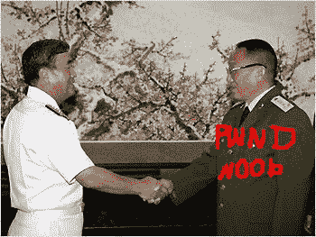

# 韩国海军支持星际战队

> 原文：<https://web.archive.org/web/http://techcrunch.com/2007/07/02/korean-navy-endorses-starcraft-team/>

# 韩国海军支持星际战队

这只发生在韩国，我发誓。我的同胞爱他们一些星际争霸，强制兵役阻碍了这种爱，但不再是了。四月，空军在*星际争霸*中描绘了人族部落的国王，林耀汉。这个简介导致网站崩溃，海军希望他们能在宣布神盾战队时取得同样的成功。这种队伍的形成对军事部门来说是一个很好的宣传，因为军人将穿着他们的制服参加比赛。韩军也在考虑组队。就像我说的，只在韩国。

[韩国海军将推出网络游戏团队](https://web.archive.org/web/20130628164909/http://english.chosun.com/w21data/html/news/200707/200707020011.html)【朝鲜日报】