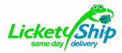
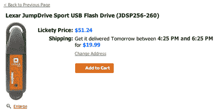

# 科兹莫怀旧？试试 LicketyShip 

> 原文：<https://web.archive.org/web/http://www.techcrunch.com:80/2006/05/11/kozmo-nostalgia-try-licketyship/>

 还记得[科兹莫](https://web.archive.org/web/20220930061441/http://www.disobey.com/ghostsites/show_exhibit/kozmo)吗？这是一项于 1998 年推出的[即时配送](https://web.archive.org/web/20220930061441/http://www.forbes.com/2001/04/12/0412topnews.html)电子商务服务(啊……1998 年……唉)。他们会在一小时内给你送来一包彩虹糖，或者一个新的掌上电脑。在烧完 2.8 亿美元的风险投资后，他们于 2001 年初宣布退出。Kozmo 有大量的需求，但它的成本结构不合理:免费送货，这相当于低利润或负利润销售。

好吧，罗伯特·帕佐尼克，总部设在旧金山的新的[舔字](https://web.archive.org/web/20220930061441/http://www.licketyship.com/)的首席执行官，并不害怕再次尝试整个事情，尽管有一个重大的转折。lick etylation 现已在选定的湾区市场进行私人测试:圣何塞、库比蒂诺、桑尼维尔、山景城、帕洛阿尔托、门洛帕克、圣克拉拉和米尔皮塔斯。

今年 1 月，在斯坦福大学的一次青年企业家活动中，我第一次看到了“舔字”。罗伯特告诉我们，30%的亚马逊订单支付隔夜运费，这表明很多人愿意为快速送货支付高额溢价。

LicketyShip 旨在通过整合当地零售商的商品(他们有 20，000 件商品的“库存”)来满足这一需求，而当地快递市场则供过于求。当你在网上订购时，你要支付大约 20 美元的额外费用(这个数字会有所不同)。LicketyShip 向当地零售商派遣快递员购买商品，然后在正常工作时间的两个小时内将商品送到您的手中。

为了做好这件事，围绕这一切的技术是复杂的，需要 LicketyShip 与它合作的主要零售商的库存系统直接交互。罗伯特不愿透露更多信息，称保持他们的专有关系和技术机密太重要了。

我完成了购买过程，但还没下订单就停止了(公司要求我推迟到下周)。在消费电子产品类别中有很多东西可供选择，而且 lick etylation 还提到了其他东西，如书籍、办公用品、家居装饰、医疗用品和食品等。

虽然你可以在[主页](https://web.archive.org/web/20220930061441/http://www.licketyship.com/)上注册他们的 beta 测试，但是 LicketyShip 暂时不会推出。

【T2