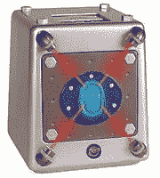

# 激光光束保险箱| TechCrunch

> 原文：<https://web.archive.org/web/http://techcrunch.com:80/2006/09/13/laaaazer-beam-safe/>

# 激光光束安全

是的，这是正确的，你现在也可以保护你最有价值的财产最邦德式的手段:激光束。它还具有，密码和生物指纹识别。感觉安全了吗？是的，这里有一个陷阱。保险箱靠 3 节 AA 电池运行，由塑料制成，所以如果你等不及电池耗尽以便掠夺它的缓存，你可以直接把它砸在墙上。这款产品在 T2 的探索商店售价 39 美元，似乎是面向儿童的。

[发现激光束保险箱](https://web.archive.org/web/20130627214827/http://www.gadgetizer.com/2006/09/12/laser-beam-safe/)【通过[加密器](https://web.archive.org/web/20130627214827/http://www.gadgetizer.com/2006/09/12/laser-beam-safe/)