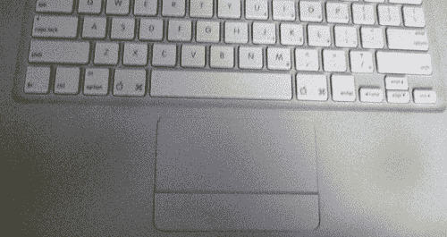

# 笔记本电脑恐怖故事条目 2: MacBook 地狱| TechCrunch

> 原文：<https://web.archive.org/web/http://techcrunch.com/2007/03/15/laptop-horror-stories-entry-2-macbook-hell/>

我们的[笔记本电脑恐怖故事](https://web.archive.org/web/20150716072555/http://crunchgear.com/2007/03/14/laptop-horror-stories-contest/)竞赛的另一个参赛作品。

> *你的白色 MacBook 怎么样了？还有问题吗？你还喜欢白色吗？*
> 
> 所以我想我应该花点时间给本回复一下我在 MacBook 上的最新体验。对于那些在家做记录的人，我对我的 Core Duo MacBook 不太满意。在我陈述我所有的 MacBook 问题之前，我要说这是早期的 MacBook。我是在 6 月 8 日拿到它的(非常记得我购买苹果产品的那一天，非常难过)，我相当确定最近的 MacBooks 已经解决了他们的问题。
> 
> 总而言之，它有随机关机问题，它有变色问题，现在它再次遭受变色(即使有一个新的情况)，除了背光闪烁和最近 RBN，随机背光打盹。现在写这篇文章，背光已经失败了两次，或者打个盹，我喜欢这样称呼它。如果我让它睡觉，然后再唤醒它，它又开始工作了。这与背光闪烁不同，当背光设置为较低水平时，背光闪烁会更明显。但是，这些和今天发生的事情比起来，都显得微不足道。

[点击此处阅读其余内容……](https://web.archive.org/web/20150716072555/http://paulstamatiou.com/2007/03/14/how-do-you-like-your-macbook/)