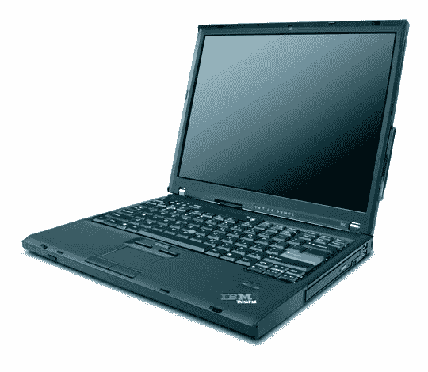

# 带 Cingular 连接的联想| TechCrunch

> 原文：<https://web.archive.org/web/http://techcrunch.com/2006/08/22/lenovo-t60-with-cingular-connectivity/>

# 带 Cingular 连接的联想 T60

嗯……两种口味……Cingular 和联想刚刚推出了支持 Cingular 的 ThinkPad T60，这意味着这是一款带有 WWAN 芯片的联想产品，可以接受 SIM 卡。

该笔记本电脑兼容 EDGE 或 GPRS 数据服务，可以漫游到全球 100 多个国家。它的重量仅为 4.8 磅，包括 14.1 英寸 TFT，80GB 硬盘，ATI Mobility 镭龙 X1300 图形芯片组，以及分别以 1.66 GHz 和 2 GHz 运行的酷睿双核 T2300 或 T2500 处理器。

笔记本电脑本身的价格约为 2000 美元，无限连接服务每月 59.99 美元。有了 Cingular GPRS，你就不会像看《迷失》第二季一样手足无措，但你可以轻松地收发电子邮件和上网冲浪。

[产品页面](https://web.archive.org/web/20130627212458/http://www-131.ibm.com/webapp/wcs/stores/servlet/PromotionDisplay?promoId=1074816425&catalogId=-840&storeId=10000001&langId=-1)【IBM】