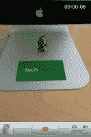
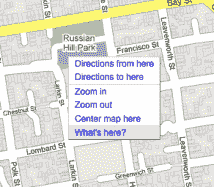
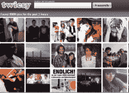
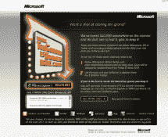

# 

> 原文：<https://web.archive.org/web/http://www.techcrunch.com:80/&usg=ALkJrhjjzIWUPhmdFB8V-HKWF0ozoAolTA/page/2/page/3/www.zimbra.com/desktop/page/2/page/3/page/4/www.zimbra.com/2008/07/18/facebook-sues-german-social-network-studivz/page/2008/05/30/laterloop-joins-the-pile-of-bookmarking-apps-with-googles-blessing/http%20:/www.crunchbase.com/person/leslie-morgenstein/>

 *披露:我没有买过 iPhone 3G S——我[还不确定是否会买](https://web.archive.org/web/20090621020805/http://www.techcrunch.com/2009/06/08/why-the-iphone-3g-s-may-be-a-suckers-bet-right-now/)。苹果给了我一个评测单元，让我玩 60 天。*

所以，我已经用最新的 iPhone 3G s 玩了一整天了。到目前为止，一切顺利。这并不意味着是一个完整的回顾——后面会有。但我想给出一个基于过去 24 小时的初步反应，因为作为一个广泛使用过第一代 iPhone 和 iPhone 3G 的人，许多用户可能有兴趣知道这个版本中让我立即感到不同的是什么。

最明显的答案[是它的速度](https://web.archive.org/web/20090621020805/http://www.techcrunch.com/2009/06/08/say-hello-to-the-iphone-3gs-s-is-for-screaming-fast/)。不可否认，它很快。但这一速度受到 AT & T 糟糕服务的严重阻碍，而且这款手机的数据传输速度大约是 iPhone 3G 的两倍，AT & T 的网络还不能做到这一点，这使得这一优势变得毫无意义。因此，我真的会把这个东西叫做 iPhone 3G V，而不是 iPhone 3G S——视频。因为这个功能，很简单，太棒了。

AOL 的新政治新闻和博客网站[PoliticsDaily.com](https://web.archive.org/web/20090621020805/http://www.politicsdaily.com/)在仅仅一个半月前推出后，在 5 月份的独立访问量上已经超过了竞争对手 Politico.com。根据 5 月份的 comScore 结果，PoliticsDaily.com 接待了 240 万独立访客，而 5 月份 Politico.com 接待了 110 万独立访客。PoliticsDaily 是一个“新闻杂志”网站，主要关注深度政治评论，而不是突发新闻，只提供原创内容，从长篇分析到关于美国政治形势问题的博客帖子。你可以在这里阅读我们对政治日报[的原始评论。](https://web.archive.org/web/20090621020805/http://www.techcrunch.com/2009/04/26/aol-launches-online-news-magazine-politicsdaily/)

这对 AOL 来说是一件大事，代表了该公司成为在线内容领域主导者的雄心。《政治日报》是美国在线高级副总裁马丁·莫伊(Martin Moe)的创意，由比尔·威尔逊(Bill Wilson)新成立的 MediaGlow 部门打造。MediaGlow 最近[推出了](https://web.archive.org/web/20090621020805/http://www.techcrunch.com/2009/04/24/aols-secret-lovecom/)话题目录 Love.com，运营着 AOL 新闻、Engadget 和 TMZ.com 等网站。

尽管 Pure Digital 凭借其翻转系列摄像机取得了巨大的成功——去年售出了价值 1 . 5 亿美元的摄像机——但他们面临着一种他们无法战胜的新型威胁。在接下来的几年里，[视频功能的 iPhone](https://web.archive.org/web/20090621020805/http://www.techcrunch.com/2009/06/10/looking-forward-to-streaming-live-video-from-your-iphone-3g-s-not-so-fast/) 和一般的视频手机将使它们变得无关紧要。

我真的越来越喜欢翻盖相机了。一年前，我认为这没有任何意义，因为大多数傻瓜相机以相同或更好的价格做了 Flip 能做的一切，而且拍出了好照片。Flip 使用起来非常简单，但是软件不是很好，在 MAC 上也不好用。我看不出携带额外设备有什么意义。

但是在去年年底，Flip [发布了宋旻浩高清版](https://web.archive.org/web/20090621020805/http://www.crunchgear.com/2008/11/11/flip-intros-high-definition-minohd-digital-camcorder/)和[一切都变了](https://web.archive.org/web/20090621020805/http://www.techcrunch.com/2009/03/19/flip-video-wrong-wrong-wrong-and-then-so-so-right/)。该设备比大多数傻瓜相机小得多，拍摄的视频也更好(大多数傻瓜相机是 1280 x 720 高清视频对 640 x 480)。他们还修复了该软件，使其在 MAC 电脑上运行良好。从盒子里拿出一个设备的喜悦——完全没有电线或电缆——是真实的。他们以 5 . 9 亿美元退出思科是理所应当的。我现在喜欢我的翻盖相机，不仅仅是因为公司给了我一张 130 万美元的支票。

除了报道的事实之外，这里真的没有什么可说的。显然，苹果公司首席执行官史蒂夫·乔布斯两个月前接受了肝脏移植手术，华尔街日报今晚报道。当你读到这一点时，你会感到非常震惊，但也没那么惊讶。

在苹果最初试图将乔布斯瘦弱的体格说成是小病之后，乔布斯本人在 1 月份公开宣布，他所患的未披露的疾病将要求他向公司请假。从那以后，他就一直休假。但《华尔街日报》报道中的好消息是，乔布斯现在实际上感觉已经足够好，可以按计划在本月底重返工作岗位——这离他回来只有几天了。

【T2

去年小配件风靡一时。而且这种趋势似乎还在增长。 [Widgetbox，](https://web.archive.org/web/20090621020805/http://www.widgetbox.com/)一个小工具创建和分发平台，据 [Quantcast 报道，在过去的一个月里，全球有 5 亿次展示。](https://web.archive.org/web/20090621020805/http://www.quantcast.com/p-3ayZhMX92Pd1o#traffic) Widgetbox 表示，绝大多数活动存在于成千上万的发布者之间，他们每月在博客中嵌入小部件，并通过合作伙伴集成 Widgetbox 的小部件图库。

尽管如此，Widgetbox 仍然落后于该领域的其他小工具制造商，包括竞争对手 [RockYou，](https://web.archive.org/web/20090621020805/http://www.rockyou.com/)根据 Quantcast 的数据，上个月的浏览量为 95 亿次。Clearspring 似乎也比 Widgetbox 更有影响力，但我们没有可比的 Quantcast 数据。根据 comScore 的数据，2009 年 4 月，Clearspring 的 widgets 有 5.2 亿独立访客。

科技之星[初创公司](https://web.archive.org/web/20090621020805/http://www.techstars.org/)Devver，正在发布其开发者服务，以加速运行 Ruby 测试框架。目前处于私有测试阶段，Devver 在他们的云上并行运行测试，完成测试套件所需的时间只有开发人员机器的 1/3。

Devver 说，使用他们的基于云的系统，将处理分散到多台机器上，它可以比典型的开发环境快很多倍地运行完整的测试套件。此外，Devver 正在构建一些特性，这些特性将减少设置和配置时间，使调度变得容易，生成丰富的报告，并使本地和分布式开发人员之间共享数据变得简单。该产品应该特别有助于鼓励开发人员的最佳实践——也就是说，在部署关键的 bug 修复之前，不要跳过整个测试套件的运行。

还记得菲利普·卡普兰，更为人熟知的名字是“Pud”，他在第一次互联网泡沫末期创建了 [FuckedCompany](https://web.archive.org/web/20090621020805/http://fuckedcompany.com/) ？是啊，他。他本周刚刚加入查尔斯河风险投资公司，成为一名常驻企业家。EIR 的职位通常是风险投资公司把他们想合作但还没有公司的高管放在那里。eir 可以看到大量的交易流程，与投资组合公司合作，通常最终会创办自己的公司，风险投资公司可以投资这些公司。

对那些太年轻不记得的人来说，FuckedCompany 是最早的死侍网站。迈克曾经写过一个愚人节玩笑，宣布 TechCrunch 已经收购了该网站，一些人仍然在严肃地问我们这个问题。但它始终只是众多项目中的一个。

 我不知道你是怎么想的，但当我看着在线地图，看到建筑物的轮廓时，我有点沮丧。我希望能够点击某个地方，并找出那里到底有什么。有了谷歌地图的新功能[，你就可以做到这一点。](https://web.archive.org/web/20090621020805/http://google-latlong.blogspot.com/2009/06/how-to-find-out-whats-here.html)

如果你右击地图上的某个地方，它会弹出一个菜单，里面有很多选项。新的最后一个选项允许您选择“这里有什么？”如果谷歌知道——它在很多地方都知道——它会弹出你所指位置的信息。如果它知道某个商店的名字，它会把它给你。否则，它会给你你所指的地址。

如果你现在被 TPS 报告搞得心烦意乱，那你应该觉得自己很幸运。本周，MySpace 的员工减少了 30%,总人数减少了大约 1000 人。国外的情况也不乐观。

但是情况可能会有所好转。上周，美国劳工部发布了失业保险每周索赔报告。虽然上周初请失业金人数增加 60.8 万，但持续申领人数降至 670 万以下。

这里是我们的裁员[追踪器](https://web.archive.org/web/20090621020805/http://www.techcrunch.com/layoffs/)，定期更新。如果你正在找新工作，CrunchBoard 可能是你找到新机会的地方。查看以下可用工作的快照:

对于欧洲的求职者来说，看看我们的[欧洲论坛。](https://web.archive.org/web/20090621020805/http://uk.crunchboard.com/ukcrunch.php)

别忘了我们正在 TechCrunch 寻找一些优秀的[黑客](https://web.archive.org/web/20090621020805/http://www.crunchboard.com/opening/detailjob.php?jid=6421)。

点击这里查看 [CrunchBoard 上的所有工作。](https://web.archive.org/web/20090621020805/http://www.crunchboard.com/jobs/)

 我发这个帖子是因为今天是周五，因为这太搞笑了，还因为这可能是最后一刻的父亲节礼物。现在就去拜访 ManBabies.com 吧。我笑个不停。

婴儿很可爱，男人通常看起来很正常——但是当你交换他们的头时，结果真的很可怕。ManBabies 就是这么做的，它创建自己的图片，并接受用户提交的照片，然后由社区投票决定。你可以很容易地通过常规途径分享所有这些照片:推特、脸书、电子邮件，你甚至可以嵌入它们。

 我不知道你，但当我看到 Twitter 上分享的一张图片的链接时，我几乎总是会点击它。实时分享图片是这项服务的一个特别有趣的用途。现在有了一种更有趣的方式，用 [Twicsy](https://web.archive.org/web/20090621020805/http://twicsy.com/) 来查看这些时间敏感的图片。

这项由社交搜索引擎[searches](https://web.archive.org/web/20090621020805/http://www.searchles.com/)推出的服务，有一个充满图片缩略图的主页。所有这些照片都是在 Twitter 上分享的，要么是在 TwitPic，要么是在 yFrog，这是目前最受欢迎的两个 Twitter 图片网站。默认显示过去一小时的图像，但是您可以设置不同的时间间隔来更改显示的图像。将鼠标悬停在其中任何一个上面，都会显示该图像的大图，以及一些关于它的细节，比如它的链接和标签。

YouTube 已经[推出了](https://web.archive.org/web/20090621020805/http://www.youtube.com/trailers)新的电影预告片目录。虽然 YouTube 过去在网站上有来自分销商的电影预告片，但谷歌的视频分享网站推出了一个新频道，官方预告片按照“最新”、“流行”、“在影院”和“即将上映”进行组织

苹果的电影预告片平台长期以来一直是分发在线预告片最全面和最受欢迎的网站。Hulu 也在其网站上提供了大量的预告片。最近，YouTube [推出了](https://web.archive.org/web/20090621020805/http://www.techcrunch.com/2009/04/16/youtube-takes-aim-at-hulu/)高级版块，包含来自 Crackle/Sony Pictures、CBS、米高梅、狮门影业、Starz、BBC、Anime Network、Cinetic Rights Management、Current TV、Discovery、纪录片频道、First Look Studios、IndieFlix 和国家地理的电影和电视节目。

Pre 正在成为一种两极分化的设备，甚至比 G1(每个人都认为它是一种测试版)还要严重，这可能是因为它是 iPhone 面临的最接近合法威胁的东西。谁不会自卫呢？凭借其前两周的强劲销售和供开发人员使用的全新操作系统，它在一开始就很强劲，但受到控制——因为骑师紧紧抓住缰绳。Palm 并没有指望在一周内有一个爆炸性的发布或一百万的应用销售；如果我们能相信他们所说的话，他们目前所得到的几乎就是他们所希望的。

当然，TechCrunch 网络是一个意见的宝库(有人会说是一个老鼠窝)，尽管我们对它感兴趣，我们还是以[攻击](https://web.archive.org/web/20090621020805/http://www.crunchgear.com/2009/05/28/palm-pre-an-also-ran/)Pre([猛烈攻击](https://web.archive.org/web/20090621020805/http://www.crunchgear.com/2009/06/16/me-on-techvi-harshing-on-the-pre/)和[反复攻击](https://web.archive.org/web/20090621020805/http://www.crunchgear.com/2009/06/03/palm-pre-promises-to-explode-into-a-supernova-of-suck/))而闻名。Pre 的应用程序销售数据需要更多的背景信息，而不是直接与 iPhone 应用程序商店进行比较，但这是一个重要的数据点，所以让我们彻底地完成它。

不，不——这个标题并不是为了评论 Android 用户的卫生状况(尽管如果我认识的许多 Android 爱好者有所暗示的话，那很可能是。Zing！)今天早上早些时候，移动分析集团 [Flurry](https://web.archive.org/web/20090621020805/http://www.flurry.com/) 向我们独家展示了他们 6 月份的智能手机行业脉搏报告。flurry 6 月份的报告收集了超过 4000 万部手机上 4 个平台(iPhone OS、黑莓、JavaME 和 Android)上运行的 1，100 个应用程序的数据，并揭示了过去几个月智能手机用户的使用习惯(包括粘性)。

昨天晚上，脸书匆忙为伊朗用户推出了一个波斯语(Farsi)版本的网站。在过去一周围绕伊朗选举的事件和随后的抗议活动之后，脸书认为迫切需要提供一个波斯语版本的社交网络，以此作为对该国公民的声援。

但最近的这一举动可能违反了脸书自己的服务条款。脸书服务条款第 4.3 条规定，“如果您位于被美国禁运的国家或在美国财政部的特别指定国民名单上，您将不能使用脸书。”

美国商务部下属的工业与安全局发言人向我们证实，目前美国对五个国家实施了禁运:伊朗、朝鲜、古巴、叙利亚和苏丹。

 为了庆祝今天 iPhone 3G 的发布，我想我应该指出一个在网络上流传的幽默的小交易。显然，你可以使用微软通过其搜索引擎运行的[返现程序](https://web.archive.org/web/20090621020805/http://www.techcrunch.com/2008/05/22/the-empire-strikes-back-our-analysis-of-microsoft-live-search-cashback/)(现在[通过 Bing](https://web.archive.org/web/20090621020805/http://www.bing.com/cashback/) )，获得该设备 35%的健康折扣。

根据你是否有资格获得美国电话电报公司的补贴，这意味着你可以花 129.35 美元买一部 16 GB 的 iPhone 3G，花 194.35 美元买一部 32 GB 的。或者更好的是，售价 64.90 美元的 8 GB iPhone 3G。是的，你可以花 65 美元买到一部新 iPhone 这要感谢微软。疯狂。

以下是如何做到这一点的完整纲要:

YouTube 搜索现在有了自己的奇迹之轮。神奇转轮是一个视觉导航工具，谷歌一个月前首次在其主搜索页面上推出，当时它增加了一些新的搜索选项，以不同的方式过滤结果。

如果你在 YouTube 上搜索，它本身将是世界上第二大搜索引擎，你会在右边的搜索框下看到一个新的选项，叫做奇迹之轮。如果你点击它，你的搜索词会出现在一个圆圈里，圆圈的线条会延伸到相关的标签。每当您单击轮子周围的相关标签时，它会创建一个新的轮子，附加到原始轮子上，并带有自己的一组相关搜索。

 在过去的几天里，我们一直在[深入挖掘](https://web.archive.org/web/20090621020805/http://www.techcrunch.com/2009/06/17/if-only-the-hungry-used-ie8-they-could-get-10000-rather-than-014-from-microsoft/)反对微软试图将 IE8 推向在线的奇怪方式。而且[我们几乎不是](https://web.archive.org/web/20090621020805/http://www.techcrunch.com/2009/06/18/mozilla-shows-microsoft-where-10000-is-buried/)唯一的[人](https://web.archive.org/web/20090621020805/http://www.techcrunch.com/2009/06/18/mozilla-shows-microsoft-where-10000-is-buried/)。显然，微软在听。

今天，它改变了这些活动中最糟糕的一个，一万美元埋在这里，取消了必须使用 IE8 才有机会赢得奖金的限制。之前，有 4 条促销规则，但微软将其削减了一半，删除了告诉你放弃当前浏览器并下载 IE8 的规则。更重要的是，它删除了告诉用户如果他们使用 IE 之外的任何东西就“迷路”的语言，并暗示他们使用任何其他浏览器都是白痴。

我们对将于 7 月 10 日星期五在八月资本举行的第四届年度夏季会议上举行的实时流处理充满了兴趣(见下面的门票信息)。自从两周前我们第一次宣布这个活动以来，一些主要的发言人已经确认了他们的出席，日程也开始变得更加紧凑。

Twitter 的发明者杰克·多西将在现场分享他关于实时流如何如此迅速地崛起以及它需要从这里走向何方的第一手资料。脸书公司的产品总监克里斯·考克斯对此有自己的看法。我们甚至可以从伦敦通过视频直播罗伯特·斯考伯，这样他就可以告诉多西关于 FriendFeed 的一切。如果 Scoble 需要帮助，FriendFeed 的联合创始人 Bret Taylor 会帮助他。

我们将从今天关注实时创业公司的两位最聪明的**投资者**之间的讨论开始:约翰·博斯威克和罗恩·康韦。两家公司都持有 Twitter 的股份，但他们对实时信息流的承诺远不止于此。

 四天前，MySpace 宣布将在美国裁员 30%并立即解雇了 400 名员工。公告称，裁员[仅适用于](https://web.archive.org/web/20090621020805/http://www.techcrunch.com/2009/06/17/myspace-isnt-done-yet-big-international-layoffs-come-next/)美国员工。这强烈表明，下一个要终止的是其 100 多名国际员工，因为它在全球有近 [30 个办事处](https://web.archive.org/web/20090621020805/http://www.techcrunch.com/2008/01/18/myspace-russia-quietly-launches-myspace-turkey-coming/)MySpace 在欧洲通过 6 个办事处覆盖 19 个地区。

现在我们从 MySpace 欧洲办公室的员工那里听到，他们描绘了一幅管理层、公关和人力资源团队之间秘密会议的黑色画面。我们被告知，MySpace 在伦敦的公关人员昨晚熬夜到很晚，讨论如何宣布 MySpace 的国际重组。不用说，欧洲 MySpace 员工在 LinkedIn 上寻求“推荐”的请求激增，我们甚至听说房地产经纪人参观了宽敞的伦敦办公室，这表明那里也在大幅裁员。