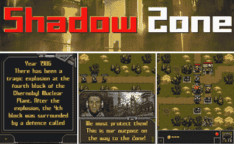

# 让我们玩全球热核战争…或者在 之后会发生什么

> 原文：<https://web.archive.org/web/http://techcrunch.com/2007/08/07/let%e2%80%99s-play-global-thermonuclear-war%e2%80%a6-or-what-happens-after/>

世界末日到了！至少在新的手机游戏《阴影地带》(Shadow Zone)中是这样，这款游戏记录了大地震后的生活。在这款来自 Ojom GmbH 的新手机游戏中，玩家必须收集稀有文物，与变异生物战斗，并穿越不祥的禁区到达震中。只有在避难所里，玩家才能阻止比天启更糟糕的命运。

Ojom GmbH 的渠道经理马克·布布说:“暗影地带是一款让玩家在攻击敌人之前就计划好行动的游戏。“这种类型的战场战略游戏是 Ojom 新方向的一步，但我们希望这种类型的粉丝也能欣赏支撑行动的引人注目的故事情节和追求。”

当你穿越一个反乌托邦的荒地时，游戏承诺将策略与行动相结合。这款游戏现在可以在大多数支持 Java 的手机上使用，主要的移动运营商也提供英语和其他欧洲语言版本。

[奥约姆:阴影地带](https://web.archive.org/web/20160329114336/http://www.ojom.com/?id=74)