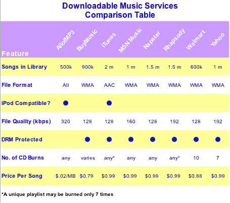

# 让我们买些音乐:第一部分 TechCrunch

> 原文：<https://web.archive.org/web/http://www.techcrunch.com:80/2006/04/07/lets-buy-some-music-part-1>

我们分析了销售数字音乐的服务(iTunes 及其竞争对手)。第 1 部分主要关注按下载付费服务。在第 2 部分([现已发布](https://web.archive.org/web/20221130194223/http://www.beta.techcrunch.com/2006/04/11/subscription-music-services-compared-part-2/))中，我们将比较吃到饱的订阅服务。

虽然自 2001 年以来，光盘销售下降了 19 %,但在线音乐销售已经开始繁荣。根据国际唱片业联盟最近在 T4 发布的一份报告，2005 年数字音乐销售收入几乎翻了三番，达到 11 亿美元。苹果的 iTunes 占据了超过 85%的单曲下载量，但是苹果在在线音乐领域并不孤单。

合法下载现在约占唱片公司收入的 6%，而两年前几乎为零。

我们已经注册了几乎所有的音乐下载和订阅网站，并准备了最好的两部分功能和价格比较。我们将网站分为“租赁”和“购买”。**【Rent】**网站是基于订阅的，吃到饱的服务，只要你继续支付月费，你就可以听目录中的所有音乐。像 iTunes 一样，网站是按下载付费的服务，你也可以将歌曲刻录到 CD 上，然后将 CD 复制到电脑上，去掉任何数字版权管理(DRM)的限制。

## 音乐下载服务

总共有 11 个网站出售可下载的 CD 刻录音乐。然而，其中两个网站，AOL Music Now 和 Virgin Digital 需要付费订阅他们的“吃到饱”服务才能下载歌曲(这两个服务的下载费用都是 0.99 美元)。因此，我们将它们排除在比较图表之外。

另一家名为 [eMusic](https://web.archive.org/web/20221130194223/http://www.emusic.com/) 的公司专注于独立唱片公司，尽管它以极具吸引力的价格(每首 0.25 美元)提供无数字版权管理的音乐，但我们已经将其从比较中剔除。eMusic 是一个很棒的服务——并排表比较没有给它应得的荣誉。

其余八项服务分别是 [AllofMP3](https://web.archive.org/web/20221130194223/http://www.allofmp3.com/) 、 [BuyMusic](https://web.archive.org/web/20221130194223/http://www.buymusic.com/) 、 [iTunes](www.itunes.com) 、 [MSN Music](https://web.archive.org/web/20221130194223/http://music.msn.com/) 、 [Napster Light](https://web.archive.org/web/20221130194223/http://www.napster.com/) 、 [Real Rhapsody](https://web.archive.org/web/20221130194223/http://www.rhapsody.com/) 、[Walmart.com](https://web.archive.org/web/20221130194223/http://www.walmart.com/music)和[雅虎音乐无限](https://web.archive.org/web/20221130194223/http://music.yahoo.com/unlimited)。

除了 iTunes，其他都使用 Windows Media Audio ( [WMA](https://web.archive.org/web/20221130194223/http://en.wikipedia.org/wiki/Windows_Media_Audio) )文件格式。iTunes 支持 [AAC](https://web.archive.org/web/20221130194223/http://en.wikipedia.org/wiki/Advanced_Audio_Coding) 格式。这很重要的唯一原因是苹果 ipod 不能播放 WMA 文件，非 ipod 也不能播放 iTunes AAC 格式。所以你的选择很大程度上取决于你选择使用哪种音乐播放器。

最佳整体服务的选择非常简单。目前服务最好的是 AllofMP3.com。音乐每 MB 0.02 美元(中等质量水平的每首歌约 9 美分)，可以以任何常见的音频格式和质量水平下载。它如此便宜和易于使用，以至于许多人选择从 AllofMP3 下载音乐，而不是翻录他们自己的 CD 收藏。

问题在于，AllofMP3 的运营规则(俄罗斯版权法)与其他公司不同。这项服务已经存在多年，拥有许多忠实用户；然而，它能否继续存在是个问题。一些人对使用这项服务有道德上的顾虑，因为没有钱回到艺术家或唱片公司手中。

在剩下的服务中，第一个问题是你将使用什么音乐播放器。**如果想用 iPod，需要用 iTunes** (或者 AllofMP3)。如果你想使用非 iPod 设备，其他任何设备都可以。非 iTunes 服务的明显赢家是 Real Rhapsody。他们有一个最大的音乐选择，迅速包括新的音乐，并有最干净的商店用户界面。Rhapsody 的下载质量也是最高的，为 192 kbps。

尽管每首歌 0.99 美元，Rhapsody 并不是最便宜的提供商。这项荣誉属于每首歌 0.79 美元的 BuyMusic。如果你对价格敏感，BuyMusic 可能是你最好的选择。

上表列出了所有服务的其他比较信息。