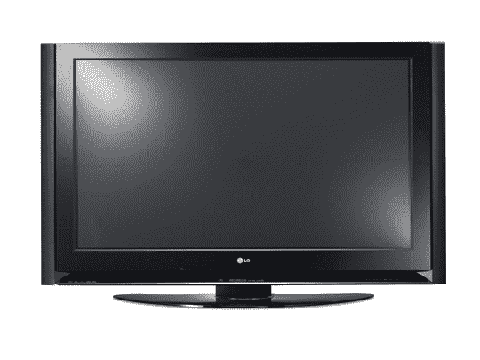

# LG 为 Opus 系列增加 50 英寸 1080p 等离子| TechCrunch

> 原文：<https://web.archive.org/web/http://techcrunch.com/2007/07/20/lg-adds-50-inch-1080p-plasma-to-opus-line/>

昨晚，50 英寸的 Opus 1080p 等离子电视在纽约著名的佳士得拍卖行首次亮相。50 英寸、50PY3D 的等离子电视充满了有用的功能，例如简单的链接连接，让您可以从一个遥控器控制其他简单的链接设备。乐趣不止于此，因为 Opus 系列包括三个 HDMI 输入、一个 USB 媒体集线器、集成的 ATSC/QAM/NTSC 调谐器以及最新的 VSB 电路，带来了迄今为止最佳的数字接收效果。

一个苗条而时尚的侧扬声器设计具有独特的反射数字索引显示，微孔扬声器格栅和非常柔软的触摸控制。如果你想买高端等离子电视，那就等到 9 月份 50PY3D Opus 上市，售价 3499 美元。