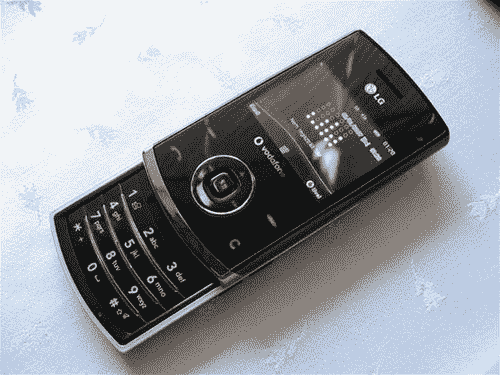

# LG KU580:像巧克力一样，只有真正的互联网功能| TechCrunch

> 原文：<https://web.archive.org/web/http://techcrunch.com/2007/06/21/lg-ku580-like-the-chocolate-only-with-real-internet-capabilities/>

LG 巧克力的诸多问题之一是其糟糕的互联网功能。虽然不是一款巧克力风格的手机，但 LG KU580 借鉴了这款标志性手机的外观和感觉，同时增加了出色的互联网功能。这是 3G，确切地说是 UMTS，所以你可以轻松地在手机网上冲浪。你还会发现几个内置的谷歌应用，比如 Gmail 和谷歌地图，我最近用它的黑莓版本在纽约北部多风、无处可去的道路上导航。LG 也不会吝啬额外的东西，所以准备好内置调频收音机、200 万像素摄像头和足够的多媒体选项，嗯，摇一摇棍子？填入你自己的陈词滥调。

目前，KU580 只计划在欧洲的沃达丰上推出。鉴于沃达丰和威瑞森无线是一体的，我敢打赌，如果这款手机真的能在美国上市，它将会在 VZW 上市。

[LG 推出 3G，巧克力风格的 KU580](https://web.archive.org/web/20160126151634/http://www.electronista.com/articles/07/06/20/lg.ku580.introduced/)