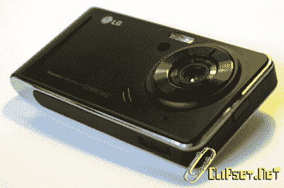
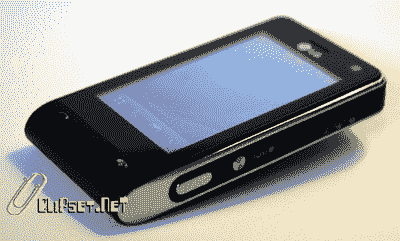

# LG KU990 又名普拉达 Dos In The Wild

> 原文：<https://web.archive.org/web/http://techcrunch.com/2007/07/12/lg-ku990-aka-prada-dos-in-the-wild/>

 [https://web.archive.org/web/20131227202656if_/http://www.youtube.com/embed/_aB5pjbp4PU?version=3&rel=1&fs=1&showsearch=0&showinfo=1&iv_load_policy=1&wmode=transparent](https://web.archive.org/web/20131227202656if_/http://www.youtube.com/embed/_aB5pjbp4PU?version=3&rel=1&fs=1&showsearch=0&showinfo=1&iv_load_policy=1&wmode=transparent)

视频

LG 普拉达尚未登陆我们的海岸，但第二代已经在互联网上流传，有视频和照片证明它的存在。它实际上可能不会被称为普拉达 2，但 KU990 可能会成为 iPhone 杀手，而它的前辈显然不会。

CrunchGear 的翻译 Nicholas 告诉我，200 万像素的相机将升级到 500 万像素，并增加了急需的闪光灯。最近风靡一时的 YouTube 也进入了 KU990，以 120fps 拍摄的视频将自动上传到你的 YouTube 帐户。为了帮助上传视频，LG 发布了 3.5G HSDPA 设备 KU990，这让我很兴奋。还包括一个调频收音机以及一个专用的谷歌应用程序。Clipset 似乎喜欢提供的小工具/部件，但我不知道他们在说什么。所有迹象都指向今年在欧洲的推出，最有可能的是在沃达丰。

我觉得有点难看

那是一个 3 英寸的屏幕还是你只是很高兴见到我？

[Videorama…LG ku 990 NYX(El móvil YouTube)](https://web.archive.org/web/20131227202656/http://www.clipset.net/2007/07/07/videorama-lg-ku990-nyx-el-movil-youtube/)【via[YouTube](https://web.archive.org/web/20131227202656/http://www.youtube.com/watch?v=_aB5pjbp4PU&eurl=http%3A%2F%2Fwww%2Eclipset%2Enet%2F2007%2F07%2F07%2Fvideorama%2Dlg%2Dku990%2Dnyx%2Del%2Dmovil%2Dyoutube%2F)