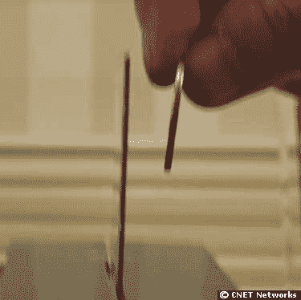

# LG 飞利浦制造超薄液晶显示器| TechCrunch

> 原文：<https://web.archive.org/web/http://techcrunch.com/2006/10/05/lg-philips-creates-ultra-thin-lcd/>

# LG 飞利浦制造超薄液晶显示器

你准备好迎接新的时尚了吗？LG Philips 发布了一款新的 LCD-TFT 显示屏，重新定义了轻薄。它的厚度只有 1.3 毫米，图像质量没有下降。

目前还没有任何订单，但这并不意味着什么。预计在 2007 年，这些将会在手机中随处可见。
 [在手机显示屏上变瘦【News.com】](https://web.archive.org/web/20130627212502/http://news.com.com/Getting+the+skinny+on+mobile+displays/2100-1041_3-6123189.html)