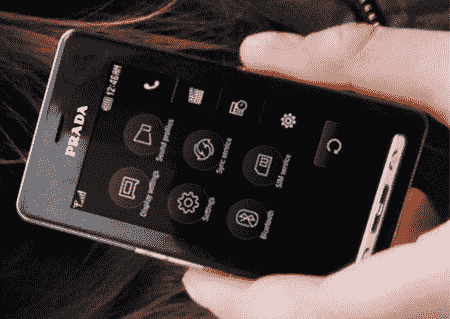

# LG 称苹果抄袭普拉达手机 TechCrunch

> 原文：<https://web.archive.org/web/http://techcrunch.com:80/2007/02/12/lg-says-apple-copied-prada-phone/>

# LG 称苹果抄袭普拉达手机

也许模仿真的是最真诚的奉承。LG R&D 手机业务主管郭宇荣(Woo-Young Kwak)表示，苹果的 iPhone 完全是 LG 普拉达手机的翻版。Kwak 继续说，在普拉达手机赢得 2006 年 iF 设计奖后，他们窃取了该设计。我怎么想？我认为这是一个巧合，Kwak 的行为就像一个大婴儿。

但随着 LG 和思科这两家知名公司向苹果发起攻击，或许乔布斯和他的公司在设计新产品时应该更加谨慎。LG 没有就法律问题发表任何言论，但如果他们在未来一两个月内起诉苹果，不要感到震惊。

[LG R & D 头坚称“苹果手机抄袭普拉达手机](https://web.archive.org/web/20230130192623/http://www.textually.org/textually/archives/2007/02/014980.htm)