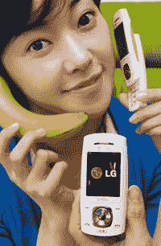

# LG SV80:香蕉的比较已经够多了

> 原文：<https://web.archive.org/web/http://techcrunch.com/2007/04/05/lg-sv80-enough-with-the-banana-comparisons-already/>

# LG SV80:香蕉的比较已经够多了

人们称 LG SV80 为香蕉手机——显然他们以前从未见过真正的[*香蕉手机*](https://web.archive.org/web/20130628160424/http://www.youtube.com/watch?v=kWKV4uC9qpM)*。LG 认为 SV80 的外形更符合人体工程学。他们最好这样做，因为形状是唯一让它有趣的东西。这款手机看起来像 2005 年的手机:130 万像素的摄像头和微不足道的 142MB 内置内存。目前只针对韩国(这是一个很大的惊喜)，坦率地说，我不知道美国人是否愿意看到带着这样一个奇怪的手机到处走。*

 *[LG-SV80 香蕉手机](https://web.archive.org/web/20130628160424/http://www.akihabaranews.com/en/news-13582-LG-SV80+the+banana+cellphone.html)【Akihabaranews.com】*