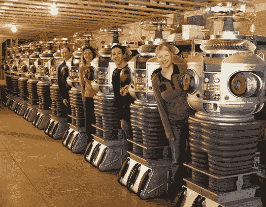

# 真人大小的“迷失太空”机器人仅售 2.5 万美元

> 原文：<https://web.archive.org/web/http://techcrunch.com:80/2007/06/06/life-size-lost-in-space-robot-only-25k/>

# 真人大小的“迷失太空”机器人仅售 2.5 万美元

好耶，[更多](https://web.archive.org/web/20130628204744/http://crunchgear.com/2007/06/05/video-baby-robot-coos-in-japanese-rolls-around-2/)机器人！今天的是一个机器人 B9 的复制品——你知道，就是《迷失太空》中的那个，总是跑来跑去，在空中挥舞手臂，警告危险和嬉皮士。她也是全尺寸的，这使得 24500 美元的价格更加诱人。

没错。如果我有额外的 25，000 美元，我可能不会买机器人，而是买一些[飞人乔丹](https://web.archive.org/web/20130628204744/http://www.finishline.com/store/catalog/product.jsp?resetResult=true&oldRequestedURI=%2fstore%2fcatalog%2fstore.jsp&productId=prod604886&categoryId=cat10003)和配套的运动衫。

[产品页面](https://web.archive.org/web/20130628204744/http://www.lostinspacerobot.com/index.html)【Lostinspacerobot.com 经[书呆子批准](https://web.archive.org/web/20130628204744/http://nerdapproved.com/misc-gadgets/lost-in-space-b9-robot-replica/)