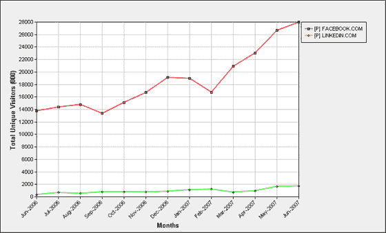

# LinkedIn 的流量上升了，但这就足够了吗？

> 原文：<https://web.archive.org/web/http://www.techcrunch.com:80/2007/07/13/linkedin-traffic-up-but-is-it-enough/>

# LinkedIn 的流量上升了，但这就足够了吗？

Hitwise 发布的最新数据[显示，LinkedIn 的访问量在去年增长了 323%,仅在上周就增长了 17%。这是一个健康的增长，LinkedIn 应该对此感到高兴，但真正的问题是:鉴于](https://web.archive.org/web/20220627090308/http://weblogs.hitwise.com/leeann-prescott/2007/07/linkedin_traffic_up_xx_users_m.html)作为*首选社交网络目的地的日益流行，这种增长足够高吗？*

 *comScore 的数据不言自明:

一些人的自然反应是认为将 LinkedIn 与脸书相提并论就像是将苹果和橘子相比较，这在一定程度上是正确的。LinkedIn 提供了一种更专注的商业网络产品，它在这方面做得相当好，但人们会涌向其他人去的地方，几乎所有认真对待社交网络的人(即成年人)都加入了脸书。

相比之下，脸书绝不是完美的商业网络平台。新接触的关系选项仍然是一个笑话，但如果认为情况会一直如此，那就太愚蠢了。脸书将改进他们的产品以满足这个市场，这不是是否的问题，而是何时的问题。

LinkedIn 正试图回应脸书的挑战；正如我们在 6 月 24 日所写的，LinkedIn 正在向第三方开发者开放其平台，以更好地与脸书竞争，但该项目的交付时间据说是“未来 9 个月”。LinkedIn 增加了新功能，如回答服务和服务推荐服务，背后还有 2580 万美元的资金。

LinkedIn 现在的问题是时间。随着脸书提供更好、更有吸引力的产品，相对静止的 LinkedIn 可能会继续运营，但它面临着在中期变得无关紧要的真正风险，如果不是更快的话。

之前的 TechCrunch LinkedIn 报道[点击这里](https://web.archive.org/web/20220627090308/http://www.beta.techcrunch.com/tag/linkedin)。*