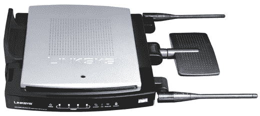

# Linksys WRT350N 802.11n 千兆路由器| TechCrunch

> 原文：<https://web.archive.org/web/http://techcrunch.com:80/2006/10/16/linksys-wrt350n-80211n-gigabit-router/>

这款 WRT350N 不仅具有 MIMO draft-802.11n 路由功能，这意味着您现在可以获得下一代无线技术，它还是一款千兆位路由器，因此您可以在网络家庭网络中以令 Flash 羡慕的速度传输文件。

所有这些无线和有线速度可以帮助你在一个迈克尔杰克逊/保罗麦卡特尼 Ebony 和象牙网络伊甸园中连接你的各种电脑，但它能帮助增加你的网络存储吗？是的。是的，它可以。

使用 Storage Link，您可以将任何支持 USB 2.0 的外部硬盘驱动器插入路由器，WRT350N 将立即拾取并将其放置在网络可访问的地址中。这意味着您的 Windows 和 Mac 电脑可以远程存储文件，并通过有线和无线方式访问它们。

尽管我们建议您等到 802.11n 最终完成后再将所有设备切换到 N，但早期采用者会发现这款路由器非常多功能。

[新闻稿](https://web.archive.org/web/20160203135832/http://www.linksys.com/servlet/Satellite?c=L_Promotion_C2&childpagename=US%2FLayout&cid=1154659473565&pagename=Linksys%2FCommon%2FVisitorWrapper)【Linksys via[Gizmodo](https://web.archive.org/web/20160203135832/http://www.gizmodo.com/gadgets/peripherals/linksys-wrt350n-gigabit-80211n-mimo-router-207555.php)via[Uber gizmo](https://web.archive.org/web/20160203135832/http://www.ubergizmo.com/15/archives/2006/10/linksys_wrt350n_gigabit_80211n_router.html)