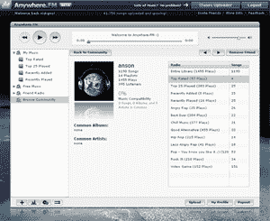

# 随时随地在网上收听您的 iTunes 资料库。FM TechCrunch

> 原文：<https://web.archive.org/web/http://www.techcrunch.com:80/2007/08/02/listen-to-your-itunes-library-on-the-web-with-anywherefm/>

# 随时随地在网上收听您的 iTunes 资料库。调频

 [Anywhere.fm](https://web.archive.org/web/20221225184922/http://www.crunchbase.com/company/anywhere.fm) 推出了一款新的在线音乐播放器，看起来和感觉上都很像基于网络的 iTunes 播放器，没有音乐市场。像 iTunes 一样，你可以加载和维护一个音乐库，将你的歌曲重新组织到播放列表中，并放松到可视化状态。Anywhere.fm 的 iTunes bulk uploader 使您可以轻松启动并运行现有的库。

该公司利用网络为他们的音乐播放器增加了便携性和社交层。目前你可以上传到播放器的歌曲数量没有上限，所以你可以创建一个潜在的无限音乐库，你可以在任何地方听。 [Streampad](https://web.archive.org/web/20221225184922/http://techcrunch.com/2006/12/08/web-based-media-player-lets-you-stream-your-itunes-to-any-computer/) 是一款几乎相同的产品，只是少了一些修饰。
  和其他社交音乐创业公司的主机一样，Anywhere.fm 也加入了音乐发现功能。虽然不像 Last.fm 和公司那样强大的发现引擎，但用户可以通过收听朋友的播放列表来找到新歌，并很快能够根据音乐兼容性得分找到新朋友。然而，由于版权问题，其他用户的播放列表只能作为广播电台传输。播放列表必须有几首歌曲长，并以随机顺序播放。不过，Anywhere.fm 并没有遵循官方在线电台播放指南，如 [Lala](https://web.archive.org/web/20221225184922/http://www.crunchbase.com/company/lala) ，该指南要求电台播放列表在发布前至少要有三个小时。

该公司在日益拥挤的在线音乐寄存服务中竞争，如 [Mp3tunes](https://web.archive.org/web/20221225184922/http://techcrunch.com/2005/12/02/oboes-web-music-locker/) 、 [Maestro](https://web.archive.org/web/20221225184922/http://techcrunch.com/2007/06/01/maestro-social-music-streaming/) 、 [imeem](https://web.archive.org/web/20221225184922/http://techcrunch.com/2007/06/20/imeem-now-officially-legitimate/) 、 [Streampad](https://web.archive.org/web/20221225184922/http://techcrunch.com/2006/12/08/web-based-media-player-lets-you-stream-your-itunes-to-any-computer/) 、 [Songbird](https://web.archive.org/web/20221225184922/http://techcrunch.com/2006/02/07/songbird-to-launch-tonight/) 和 [MediaMasters](https://web.archive.org/web/20221225184922/http://techcrunch.com/2007/04/06/mediamasters-joins-the-mp3com-2-crew/) 。这项服务确实受益于简单、免费和社会化，但现有用户有一个稳定的开端。Hype Machine、 [RadioBlogClub](https://web.archive.org/web/20221225184922/http://techcrunch.com/2007/03/14/radioblogclub-abandons-old-pirate-ship-for-bigger-one/) 和 [Blogmusik](https://web.archive.org/web/20221225184922/http://techcrunch.com/2006/09/09/check-out-blogmusik-before-its-pulled-off-the-internet/) 也是工作时听音乐的其他低麻烦方式。

Anywhere.fm 希望在向用户收取服务费之外赚钱。他们正在考虑一个显而易见的步骤，为你不拥有的歌曲销售附属音乐，在广播流中插入音频广告，并直接销售音乐。目前，该播放器列出了来自 Band.com 车库的独立音乐，这可能会成为一个直接的销售点。

Anywhere.fm 是一家 [Y Combinator](https://web.archive.org/web/20221225184922/http://www.crunchbase.com/company/ycombinator) 创业公司。

**更新:**好的视频点评是[这里的](https://web.archive.org/web/20221225184922/http://s3.amazonaws.com/anywherefm_videos/anywherefm_review.wmv)。