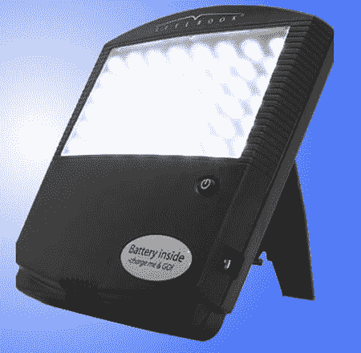

# Litebook 吻别——TechCrunch

> 原文：<https://web.archive.org/web/http://techcrunch.com:80/2006/09/05/litebook-kisses-sad-goodbye/>

# Litebook 亲吻悲伤的告别

季节性情感障碍发生在季节变化时，一个人变得，嗯，悲伤(双关语)。暴露在某些类型的强光下可以欺骗昼夜节律机制，抑制褪黑激素，使人产生悲伤的感觉。Litebook 有 24 个明亮的白色 led，一个支架和一个夹子。该设备已经过临床验证，是 100%便携的，允许 SAD 患者随身携带。如果这东西能让我觉得一年到头都是夏天，让我忘记寒冷和下雪，那就给我报名吧。Litebook 将于下月发布，售价 379 美元。你也可以购买可充电的 Litebook Charge 'n' Go，每次充电 447 美元，可以进行两次 30 分钟的会话。

[Litebook](https://web.archive.org/web/20201123195625/http://www.gizmodo.com/gadgets/gadgets/litebook-for-sad-chase-those-winter-blues-away-198572.php)