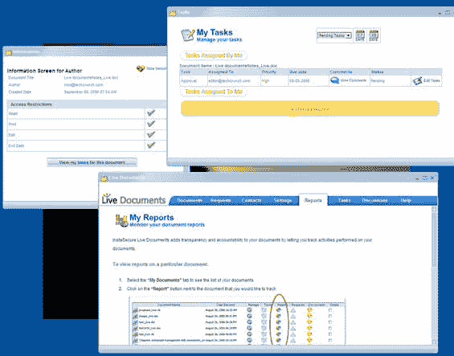

# Live Documents 是强大的工具——TechCrunch

> 原文：<https://web.archive.org/web/http://www.techcrunch.com:80/2006/09/08/live-documents-is-powerful-stuff/>

  一项名为 [Live Documents](https://web.archive.org/web/20220808075029/http://www.live-documents.com/) 的新服务允许已经安装了 Office 的 Windows PC 用户通过互联网在多个用户之间同步文档。该服务目前通过工具栏处理 Word 和 Excel 文档(据说其他办公应用程序也即将推出)。在测试阶段，这项服务是免费的。

文档的创建者设置其他用户的权限(只读、读写、打印权限等。)并将文件通过电子邮件发送给他们。当其他用户打开该文档时，当用户在线时，跨所有用户的该文档的所有实例被定期同步。

这是一个功能强大的应用程序，解决了维基和在线单词克隆(如 Zoho Writer 和 Writely)的主要好处之一——通过互联网进行协作。从用户角度来看，其功能与微软 [Sharepoint Portal Server](https://web.archive.org/web/20220808075029/http://www.microsoft.com/sharepoint/default.mspx) 非常相似，后者允许业务用户通过集中式 Windows 服务器协作处理文档。与 Sharepoint 不同，Live Documents 不在服务器上存储任何文档，因此不需要您拥有自己的(非常昂贵的)Windows 服务器。

我们已经在办公室的两台电脑上测试了 Live Documents，它运行得非常完美。我们期待 Mac 版本，以及至少 PowerPoint 的扩展功能。

Live Documents 的下一步应该是在在线 office 玩家中寻找一个合作伙伴，使他们的服务也能跨应用程序工作。当这种情况发生时，一个 Word 用户将能够与一个 Zoho Writer 用户就一个文档进行实时协作，例如通过互联网。

