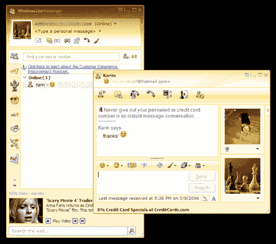

# Live Messenger 向公众开放

> 原文：<https://web.archive.org/web/http://www.techcrunch.com:80/2006/05/08/live-messenger-opens-to-public/>

[Windows Live Messenger](https://web.archive.org/web/20220811111147/http://ideas.live.com/programPage.aspx?versionId=0eccd94b-eb48-497c-8e60-c6313f7ebb73)，以前只能通过邀请才能使用([类似于](https://web.archive.org/web/20220811111147/http://spaces.msn.com/messengersays/blog/cns!5B410F7FD930829E!11977.entry))，于太平洋时间今晚(周一)晚上 9 点开始对公众开放。它只适用于 Windows PCs，必须用 IE 下载(没有 Firefox)，并且在[ideas.live.com](https://web.archive.org/web/20220811111147/http://ideas.live.com/)有售。

MSN 和 Windows Live Messenger 的产品经理 Karin Muskopf 今天早些时候向我简要介绍了这些新功能。Live Messenger 的界面比当前的非测试版 MSN Messenger 7.5 更简洁。其他改进包括在窗口底部与 MSN 视频的集成，以及将名为 Windows Live Call(由威瑞森提供支持)的 VOIP 预付费呼叫功能扩展到八个新市场(奥地利、比利时、芬兰、爱尔兰、意大利和荷兰)。您还可以对 Live Messenger 模板进行一些更改，例如颜色自定义。此外，他们正在推出离线消息服务，就像雅虎和 Skype IM 一样，你可以给离线的人发送消息，他们登录后就会收到。

不过，我最喜欢 Live Messenger 的功能是通过与之前收购的 Foldershare 产品集成来共享文件。将任何类型的文件拖到 Live Messenger 中的联系人姓名中，将在您的每个桌面上创建一个文件夹，其中包含该文件的副本。对文件的任何更改都将复制到这两个文件夹中。我经常使用 Skype 进行文件传输，Live Messenger 集成更加简单易用。

Live 团队没有透露他们将何时推出该产品的 API，甚至将它集成到他们自己的 Live.com 中，因为 Gtalk 已集成到 Gmail 网站中。但现在任何人都可以尝试 Live Messenger，我相信新功能正在开发中。

