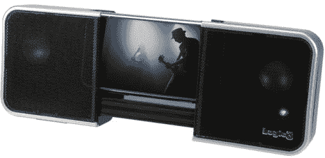

# Logic3 发布首款 iPhone Dock，iSuck I-Station Traveler | TechCrunch

> 原文：<https://web.archive.org/web/http://techcrunch.com/2007/08/15/logic3-unleashes-1st-iphone-dock-isuck-i-station-traveler/>

Logic3 有幸成为第一个销售 iPhone 扬声器基座的产品。伙计们，掌声是理所当然的。值得一些嘘声和嘘声的是他们选择的名字，iPhone 的 i-Station Traveler。你面前看到的基座允许 iPhone 垂直或水平对接，不使用时可以滑动关闭。你不会用 35 毫米钕驱动器和 4W 的耳膜吹气输出举办任何家庭聚会，但这是第一次，所以让我们给 Logic3 一些信任。它甚至包括一个 3.5 毫米的插孔和 2.5 毫米的转换器，供您选择。对于世界上第一个 iPhone 基座来说还不算太寒酸，它的零售价约为 65 美元。

[逻辑 3](https://web.archive.org/web/20160422081238/http://www.spectravideo.com/index.php?page=shop/index&region=UK)【via[Ubergiz](https://web.archive.org/web/20160422081238/http://www.ubergizmo.com/15/archives/2007/08/logic3_dedicated_iphone_speaker_dock.html)