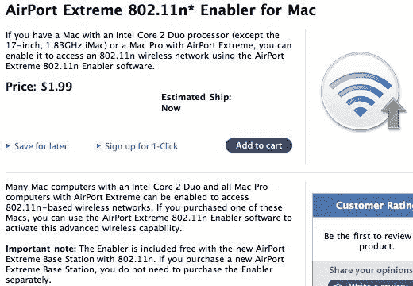

# 罗技推出纯保真 iPod 音响

> 原文：<https://web.archive.org/web/http://techcrunch.com/2007/08/16/logitech-introduces-pure-fi-ipod-stereos/>

# 罗技推出纯保真 iPod 音响

罗技纯美梦

你猜怎么着？罗技现在正在升级其 iPod 配件系列，推出一系列全新的音乐系统，名为 Pure-Fi。首先是 Pure-Fi Anywhere，它提供一键洗牌和重复，一个遥控器，2 英寸 Max-X 驱动器和一个 10 小时可充电电池。售价为 150 美元，将于本月与罗技纯保真梦想卧室音乐系统(简称罗技纯保真梦想)一起上市。

现在，该系统专为卧室设计，可用作闹钟、AM/FM 收音机、一键播放列表和电台选择、运动激活背光控制、自动调节 LCD(夜间变暗并显示歌曲信息)。3/4 英寸的圆顶高音扬声器和 3 英寸长的低音扬声器让你如梦初醒，所以请确保你对 [boom boom boom](https://web.archive.org/web/20130628165319/http://youtube.com/watch?v=JT5AQIlmM0I) 很放松。你可以在月底花 250 美元买一个纯保真的梦。跳完之后，到处都是纯净的画面。

[罗技推出纯 Fi iPod 扬声器系统](https://web.archive.org/web/20130628165319/http://ilounge.com/index.php/news/comments/logitech-launches-pure-fi-ipod-speaker-systems/)

