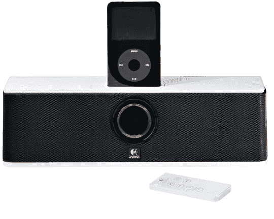

# 罗技推出 iPod 扬声器

> 原文：<https://web.archive.org/web/http://techcrunch.com/2006/08/17/logitech-launches-ipod-speakers/>

过去几天，罗技传出了不少消息。首先，他们[有一系列耳机](https://web.archive.org/web/20141221010101/http://crunchgear.com/2006/08/16/logitech-audio-gear-hands-on/)，现在这两个扬声器。

售价 299.99 美元的罗技 AudioStation 包括一个内置的 AM/FM 收音机，有一个背光的触摸感应控制面板和 LCD street。它可以与任何 iPod 兼容，并包括一个不错的 3D 声音 DSP。

售价 129.99 美元的 AudioStation Express 稍小一点，靠交流电或电池供电。它还包括一个遥控器和一个旅行用的旅行箱。

这两款产品都采用了罗技现在似乎正在采用的精益美学。AudioStation 几乎看起来像一个音箱，有一个漂亮的有机发光二极管式的脸和很棒的扬声器格栅。它们听起来会是什么样的？我有一套我们在厨房使用的罗技便携式扬声器，它们非常适合日常使用，如果我演示的免提 Skype 产品有任何指示，它们就很好。