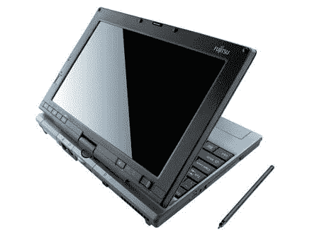

# 好看——富士通 P1610 平板电脑——TechCrunch

> 原文：<https://web.archive.org/web/http://techcrunch.com/2007/03/02/lookin-good-the-fujitsu-p1610-tablet-pc/>

# 好看——富士通 P1610 平板电脑

个人认为，平板电脑如果没有内置键盘，完全没用。谢天谢地，富士通知道键盘+平板电脑+出色的设计=赢家。P1610 平板电脑提供了一些出色的功能，包括 HSDPA、UMTS、EDGE、GPRS 和 GSM，几乎可以确保您无论身在何处都能保持联系，即使是在蝙蝠洞也不例外。

但是疯狂的 WWAN 功能并不是 P1610 包的全部，它还包括蓝牙 2.0、8.9 英寸触摸屏 LCD、512MB/1GB 内存、4 小时电池寿命和 80GB 硬盘。唯一阻碍这款平板电脑的是它使用了英特尔酷睿单核 CPU。核心 Solo？我们不想要讨厌的核心独奏！给我们一些 Core 2 Duo Fuj，然后我们再谈。

[富士通 P1610 平板电脑获得 3G HSDPA 升级](https://web.archive.org/web/20220127105506/http://www.coreduonews.com/2007/03/01/fujitsu-p1610-tablet-pc-gets-3g-hsdpa-upgrade/)