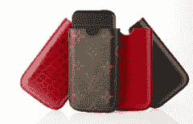

# 路易威登 iPhone 手机壳| TechCrunch

> 原文：<https://web.archive.org/web/http://techcrunch.com:80/2007/07/17/louis-vuitton-iphone-cases/>

你不需要很富有就能拥有一部 iPhone，但能花两倍于手机本身的钱买一个外壳意味着你过着奢侈的生活。这些路易威登包可以从明天开始在曼哈顿第五大道的标志性商店以 225 美元的低价买到。是的，很贵，但对大多数人来说是可行的。毕竟，那部 iPhone 确实花了你 500 或 600 美元外加税。

然而，对于那些有阿斯顿、法拉利和一个爱唠叨的妻子的人来说，有一个终极的 iPhone 外壳。这个奢华的箱子由鳄鱼皮制成，染成了令人惊叹的红色，售价高达 1120 美元。是的，为了时尚地保护你的 iPhone，你必须支付超过两部 iPhone 的保护套费用。荒谬，但完全可以理解。有人必须迎合精英阶层，谁比路易威登更适合做这件事呢？

[路易威登 iPhone 保护套](https://web.archive.org/web/20131227194040/http://www.boygeniusreport.com/2007/07/17/louis-vuitton-iphone-cases/)【BGR】