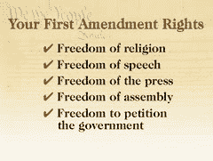

# 路易斯安那州法官否决了暴力游戏禁令

> 原文：<https://web.archive.org/web/http://techcrunch.com:80/2006/08/29/louisiana-judge-declines-violent-game-bad/>

路易斯安那州的一名地区法官今天否决了一项禁止向未成年人出售暴力视频游戏的法案。美国地区法官詹姆斯·布雷迪表示，该州无权阻止任何游戏的发行，因为它们包含暴力。

> 布雷迪称这项法律是对生产商、零售商和玩游戏的儿童的“第一修正案权利的侵犯”。他说对暴力的描述“有权得到宪法的全面保护”

问题是，我们已经有了一个游戏分级系统，禁止未成年人购买。路易斯安那州没收到备忘录吗？

编辑:我住在路易斯安那州，我觉得有资格说，该州应该少担心像这样的废话，多关心如何解决真正的问题。今天，8 月 29 日，可能会更加明显，在卡特里娜飓风过去一年后，这座城市仍然被夷为平地，防洪堤没有修复，犯罪率呈指数增长。谁会在乎电子游戏？布雷克

路易斯安那州法官拒绝暴力游戏禁令【问询者报】