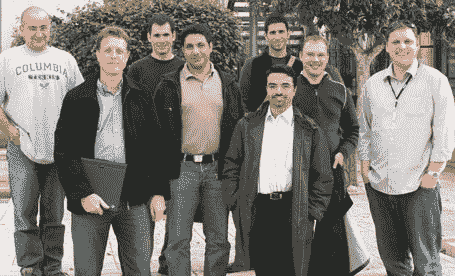

# 以色列午餐:六家初创公司、一家风投公司和一位博客作者 

> 原文：<https://web.archive.org/web/http://www.techcrunch.com/2006/03/01/lunch-in-israel-six-startups-and-a-vc/>

上周日，我在以色列特拉维夫参加了一个特别的技术午餐会，会见了那里的六家优秀的 web 2.0 初创公司。与会的有来自 I4giveu、Maxthon、Raw Sugar、Spotback、Triplay 和 Yedda 的创始人。双子座以色列基金的丹尼尔·科恩、欧瑞尔·欧哈扬( [TechCrunch 法](https://web.archive.org/web/20230219030325/http://fr.beta.techcrunch.com/)作者)和其他技术爱好者也在那里。

我们吃了一顿大餐，进行了一场精彩的讨论。我在活动中拍的照片在 flickr [上传到这里](https://web.archive.org/web/20230219030325/http://www.flickr.com/photos/michaelarrington/tags/techcrunchtelaviv/)。

与会的六家初创企业包括:

创始人 Alon Carmel 是一位天才的设计师和开发者，他正准备推出他的隐形项目 I4giveu。这项服务的细节很少被披露，但我一如既往地喜欢电子邮件收集登录页面，它承诺在很短的时间内带来惊喜。报名[这里](https://web.archive.org/web/20230219030325/http://www.i4giveu.com/)。阿龙说的一件事是这样的:“每个用户都将根据其他社区用户对他的帖子的排名获得从天使到魔鬼的声誉。”听起来很有趣！

  Netanel Jacobsson 代表[傲游浏览器](https://web.archive.org/web/20230219030325/http://www.maxthon.com/)，这是一款有争议但很受欢迎的 IE 浏览器，下载量已超过 5000 万次。Ouriel Ohayon 在这里写了关于傲游的文章。

  原糖的管理团队位于硅谷，开发团队由来自以色列海法的 Frank Smadja 领导。我以前在 TechCrunch 上写过关于[原糖的文章](https://web.archive.org/web/20230219030325/https://techcrunch.com/tag/Raw-Sugar/)，他们正准备推出一项新功能，该功能将自动从博客中导入标签和类别信息，以创建一个可浏览和搜索的目录。很棒的东西。

Spotback 创始人 Micha Kaufman 和 Amit Kaufman 让我提前了解了受证书保护的 Spotback，**将成为赢家**。很快就会看到完整的个人资料，但 Spotback 是一个个性化的新闻和评级/分享网站，具有非常强大的功能，将为 Newsvine 这样的领先者提供真正的资金。设计和功能是一流的。在这里注册测试版。如果 Spotback 在不久的将来获得以色列和美国的联合风险投资，我不会感到惊讶。

亚龙·奥伦斯坦(Yaron Orenstein)向我简要介绍了 Triplay，一家非常年轻的公司，它正在寻求创建一个跨平台多媒体平台(电脑-手机-电视)。网站上的细节很少，但 Triplay 看起来很有趣。*“考虑人而不是技术…TriPlay 的超级消息服务将使人们能够通过他们的 PC、电视和移动设备轻松交流所有类型的媒体和内容。”*请尽快查看关于[mobile runch](https://web.archive.org/web/20230219030325/http://www.mobilecrunch.com/)的完整评论。

  从去年 12 月开始，我一直在和 Yedda 的创始人 Yaniv Golan 和 Avichay Nissenbaum 谈话。请看我从一月份发的关于它们的[挑逗帖](https://web.archive.org/web/20230219030325/https://techcrunch.com/2006/01/25/community-search-with-yedda/)。Yedda 应该会在接下来的几周内把包装拿掉，我会做一个完整的简介。

所有这些企业家都很谦逊，而且才华横溢。我很高兴看到以色列出现了好东西，并期待着看到这六家新公司的成长。

