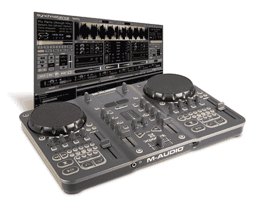

# M-Audio 的 Torq Xponent:完整的基于计算机的 DJ 系统| TechCrunch

> 原文：<https://web.archive.org/web/http://techcrunch.com:80/2007/06/20/m-audios-torq-xponent-the-complete-computer-based-dj-system/>

文斯和我喜欢一切与 Torq 有关的东西，因为我们是崭露头角的 DJ。最新的 Torq DJ 系统，M-Audio 的 Xponenet，仅从按钮和转盘的数量来看，就非常惊人。然而，它的价格——750 美元——确实让我无法参与。像它较小的 X Session Pro 堂兄一样，Xponent 是一个基于计算机的 DJ 系统，使用一些令人印象深刻的软件使创建自己的混音变得相当容易。不过，Xponent 更多的是面向专业人士，它应该一劳永逸地弥合“传统 DJ 硬件和当今强大的性能软件之间的差距。”

基本上，Xponent 是一个更全面、更专业的 MixLab 版本，我每周都要使用这个产品好几次。把价格降下来，嗯，降很多，我就能搞定了。

[产品页面](https://web.archive.org/web/20160402212145/http://www.m-audio.com/products/en_us/TorqXponent-main.html)【M-Audio via[MacNN](https://web.archive.org/web/20160402212145/http://www.macnn.com/articles/07/06/20/m.audio.ships.torq.xponent/)