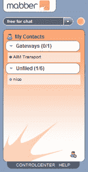
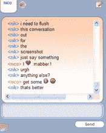

# Mabber 移动即时消息–TechCrunch

> 原文：<https://web.archive.org/web/http://www.techcrunch.com:80/2006/02/23/mabber-mobile-instant-messaging/>

将开放式即时通讯协议 [Jabber](https://web.archive.org/web/20220204002123/http://www.jabber.org/) 与手机混合，你就会得到 [Mabber](https://web.archive.org/web/20220204002123/http://www.mabber.com/) ，这是德国科隆一个团队的新产品。Mabber 的团队是 Jabber 协议的早期采用者，由于他们国家的移动数据费用较低，他们决定开发一种应用程序，允许移动用户使用该协议相互通信，从而节省短信费用。Mabber 是新媒体管理公司的产品，这是一家德国公司，经营着一些全国最大的网络资产，如 [neu.de](https://web.archive.org/web/20220204002123/http://neu.de/) 和 [pkw.de](https://web.archive.org/web/20220204002123/http://pkw.de/) ，

Mabber 已经组建了一个非常有经验和坚实的团队，总共有六个人，从负责管理团队和指导业务的 [Nico Lumma](https://web.archive.org/web/20220204002123/http://lumma.de/) 开始(他也是德国非常受欢迎的博主)。团队的其他成员包括 [Florian Holzhauer](https://web.archive.org/web/20220204002123/http://fholzhauer.de/b/) (他是 Jabber 基金会的成员) [Stefan Strigler](https://web.archive.org/web/20220204002123/http://zeank.in-berlin.de/) 、 [Jens Ohlig](https://web.archive.org/web/20220204002123/http://bildschirmarbeitzplatz.blogg.de/) 、Oliver Lauer 和 Christian Horchert。

Mabber 主要使用 Jabber 协议，但他们也支持其他网络，如 MSN、Yahoo！，AIM–这是为了让您在切换到 mabber 时，不会失去与现有 IM 提供商的联系或功能。Mabber 在线支持所有这些协议，这意味着一旦您设置了帐户，您就可以在该网络上看到您的联系人，以及来自其他网络和主要 mabber 网络的其他联系人。

mabber 应用程序有两个部分。第一个是可以从任何浏览器访问的 web 应用程序。和 Meebo 一样，这些人在改善用户体验上花了很多时间。我注意到的第一件事是，聊天窗口没有任何重绘效果，看起来工作无缝——客户端轮询服务器时没有奇怪的延迟，只有即时反应。其次，我注意到的是所有丰富的功能。它们扩展了桌面 IM 客户端的所有流行功能，如聊天历史(可以在以后完全搜索)、分组(和群聊)以及提供选项的上下文菜单。

网络界面本身会让 Meebo 物有所值，但 Mabber 的魔力在于移动设备。要安装移动应用程序，您需要访问该网站并输入您的手机号码，然后您会收到一条带有下载链接的短信，接着，它会安装并执行，您输入您的用户名和密码，然后您就可以在线了。从这一点上，您可以访问所有的即时消息联系人，并使用标准的手机键盘与他们交流。这将为人们节省大量的短信费用(目前在大多数国家这只是明目张胆的抢劫)，并让人们更有效地沟通。我知道这不是第一个移动 IM 应用程序，但这个团队的组合，他们选择的协议，他们简单的应用程序和基于移动和浏览器的界面意味着 Mabber 有很大的成功机会。

我已经使用 Mabber 快一天了，现在我正在评估这是不是我的 Meebo 替代品。Nico 一直在谈论他们在本周应该推出的一些功能，包括选项卡式聊天窗口、移动设备内容交付和其他改进。这些家伙非常频繁地发布，他们的私人测试版到目前为止进展顺利。他们打算在德国市场大展拳脚，我相信他们在其他市场也会做得很好，尤其是如果普通消费者发现这项服务像我一样容易安装和使用的话。

**立即使用 Mabber:**Mabber 已经好心地向 Techcrunch 的读者发出了 50 份测试邀请。如果你想开发一款在移动设备上运行的非常酷的即时通讯应用，那么就给 info@mabber.com 发一封电子邮件，主题是“TECHCRUNCH！！！！!'作为回报，你会收到一封邀请函。