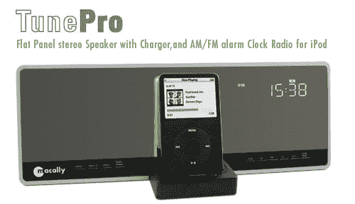

# Macally 的 TunePro:对于那些还没有 iPod 扬声器+Dock | TechCrunch 的人

> 原文：<https://web.archive.org/web/http://techcrunch.com/2007/08/08/macallys-tunepro-for-those-of-you-who-still-dont-have-an-ipod-speakerdock/>

我无法想象想买 iPod 扬声器+基座的人还没有 iPod 扬声器+基座的场景，所以公司不断发布它们有点奇怪。看看这个来自 Macally 的 TunePro one。看起来眼熟，我是说，除了看起来像其他码头？是的，我想是的。为其辩护，有一个整洁的小 LED 显示屏。除此之外，它是一个标准配置:AM/FM 收音机，线路输入插孔，兼容所有 iPods 等。如果你愿意，130 美元。

Macally 将在今年秋天发布一款这样的 iPhone。希望到那时我们会有新的 iPods，因为现在 5/5.5G 的有点过时了。

[产品页面](https://web.archive.org/web/20160422064724/http://www.macally.com/EN/product/ArticleShow.asp?ArticleID=159)【Macally via[Electronista](https://web.archive.org/web/20160422064724/http://www.electronista.com/articles/07/08/08/macally.tunepro.speakers/)