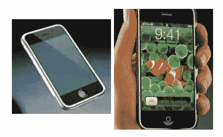
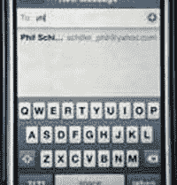

# MacWorld 实时公告–iPhone 发布

> 原文：<https://web.archive.org/web/http://www.techcrunch.com:80/2007/01/09/macworld-announcements-real-time/>

# MacWorld 实时公告–iPhone 发布

在旧金山举行的 2007 年 MacWorld 大会上，史蒂夫·乔布斯的主题演讲才刚刚开始，预计将会有重要的新产品发布。我们有一个团队在这里[和在 T2【crunchgar】做现场报道。敬请关注。](https://web.archive.org/web/20220818134224/http://crunchgear.com/2007/01/09/crunchgear-macworld-2007-the-keynote/)

苹果商店关闭，直到主题演讲结束，这才刚刚开始。[克朗彻格](https://web.archive.org/web/20220818134224/http://crunchgear.com/2007/01/09/crunchgear-macworld-2007-the-keynote/)的每分钟更新。

前 20 分钟左右都是关于 iTunes 的。iTunes 上已售出 20 亿首歌曲和 130 万部电影。现在有超过 250 部电影。350 个电视节目。基本上，乔布斯是在表明 iTunes 非常强大。

然后，乔布斯转向了 iTV，这是一款新的客厅硬件设备，我们在去年秋天的文章中提到过。iTV 是一个工作名称，现在被称为苹果电视。这款带有致命遥控器的设备可能会让苹果成为客厅里的有力竞争者。这款设备售价 299 美元，将于 2 月份上市。
 **iPhone 公布**

大新闻……经过两年半的开发，苹果终于发布了 iPhone(图片是真实的设备)。姓名已确认。该设备有一个大而宽的触摸屏和一个虚拟键盘，运行 OSX。这款设备有 3.5 英寸的触摸屏，8 GB 的存储空间，200 万像素的摄像头和一个按钮。还支持 wifi。Cingular 是载体。这东西将运行桌面风格的应用程序。通过浏览器获取谷歌地图。像桌面一样查看电子邮件。有两种型号。4 GB 的是 499 美元。5 GB 的是 599 美元。他们要到六月才会上市。哦。太好了。

很明显我要换成 Cingular 了。六月。

 [更新即将到来……](https://web.archive.org/web/20220818134224/http://crunchgear.com/2007/01/09/crunchgear-macworld-2007-the-keynote/)