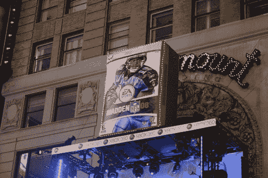
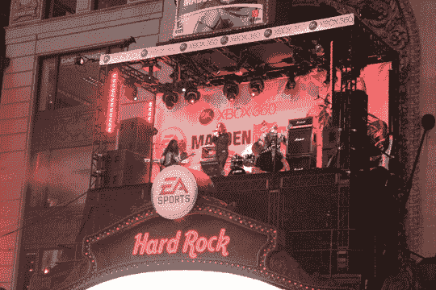
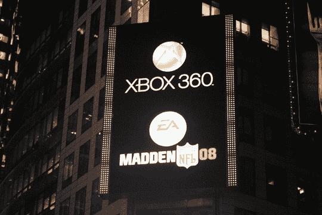
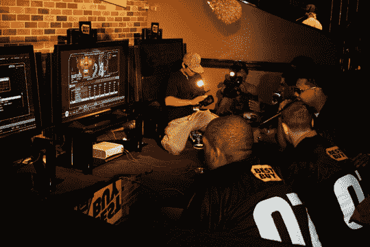

# Madden NFL '08 纽约发布会:时代广场改造| TechCrunch

> 原文：<https://web.archive.org/web/http://techcrunch.com/2007/08/14/madden-nfl-08-new-york-launch-times-square-transformed/>

微软和艺电昨晚花了一大笔钱在时代广场推广《疯狂橄榄球 08 T4》。这款游戏——你可能听说过——在时代广场玩具反斗城享受了午夜发布，现在应该在你当地的商店里。虽然我个人不会庆祝“疯狂足球日”(我更喜欢另一种足球，你可能已经注意到了)，但我确实熬夜到午夜的可怕时刻，捕捉照片，采访足球巨星，了解他们对 EA 印钞许可证最新一期的看法。

Ozzy 在硬石咖啡馆的顶上表演，诅咒着蓝色条纹，在舞台上喃喃自语，笨手笨脚。

奇怪的是，昨晚没有发现 PS3 的标志。微软的金库再次罢工。

除了在 Madden challenge 期间喧闹的播音员(获胜者为他的麻烦带回家 1000 美元)，Madden 的推出正如你所预期的那样顺利。大量的排场，包括一个“盒子投放”，有点像新年的球投放…只是有一个 *Madden NFL '08* 盒子。

在职业足球运动员中，埃里克·迪克森似乎对这款游戏的推出最感兴趣。作为 Xbox 360 和 PSP 的粉丝，Dickerson 对他一次花在玩游戏上的时间赞不绝口。虽然他说这很尴尬，但我知道超级富豪、著名运动员也会连续玩几个小时的电子游戏，这让我颇感自豪。

所以，是的，新的*马登的*出来了。玩这个游戏的人说它比去年的更有神秘感，所以不管怎样都要相信它。

[Madden NFL ' 08](https://web.archive.org/web/20140812040726/http://www.easports.com/maddennfl/home.jsp)【EA】