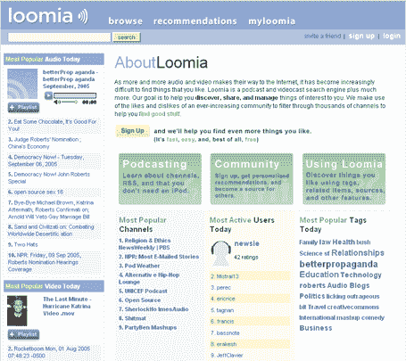

# 卢米亚的大修 

> 原文：<https://web.archive.org/web/http://www.techcrunch.com:80/2005/09/16/major-overhaul-at-loomia/>

昨晚， [Loomia](https://web.archive.org/web/20230213030746/http://www.loomia.com/) ( [简介](https://web.archive.org/web/20230213030746/https://techcrunch.com/2005/07/27/profile-loomia/))的首席执行官大卫·马克斯给我发来电子邮件，告诉我网站的新功能和新外观。

Loomia 是一个优秀的播客和视频资源。您可以订阅播客，并通过网站收听它们，或者将它们下载到您的电脑或设备上。关键的增值是他们的推荐引擎——你对媒体进行评级，然后根据你的评级和其他社区成员的评级获得推荐(这和网飞向你推荐新电影的方式一样)。

除了大量的视觉改进，Loomia 还增加了媒体标签，创造了一种新的方式来查找相关内容的播客和视频。

看看 Loomia 吧，它是免费的，也是我们所知的寻找新的播客和视频内容的最佳资源。