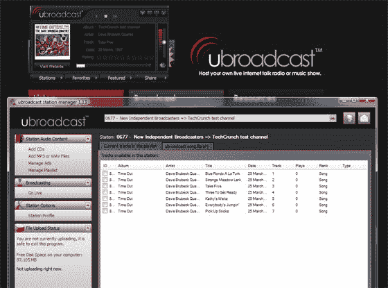

# 打造自己的网络电台:ubroadcast 

> 原文：<https://web.archive.org/web/http://www.techcrunch.com:80/2007/06/07/make-your-own-internet-radio-station-ubroadcast/>

# 打造自己的网络电台:ubroadcast

 [ubroadcast](https://web.archive.org/web/20230203020702/http://www.ubroadcast.com/) 提供了一个平台，让用户能够创建和广播自己的网络电台。

ubroadcast 的电台管理软件允许用户主持一个现场互联网谈话广播或音乐节目，包括播放列表支持、内嵌 CD 抓轨、MP3 上传、广告和其他预先录制的内容。

用户生成的网络电台并不新鲜。Live365 和 [Shoutcast](https://web.archive.org/web/20230203020702/http://www.shoutcast.com/) 多年来一直提供类似的功能。ubroadcast 的不同之处在于简单性和成本:建立和运行 ubroadcast 电台是免费的，学习曲线接近于零。这是更多面向大众市场的网络电台创作。

安装时间不超过 5 分钟。客户端可以快速下载，并且内置了注册选项。用户可以立即广播直播内容，上传 MP3 音乐，或者选择其他 ubroadcast 成员上传的音乐。现有 ubroadcast 播放列表缺乏深度；这不是 Last.fm 或类似的拥有大量音乐库的网站，它只是用户上传的内容，我想随着服务的发展，这将不再是个问题。

我发现这项服务唯一的缺点是听众需要下载 ubroadcast 播放器来收听电台。ubroadcast 的 John Castiglione 告诉我，“一些功能与互联网电台以前见过的任何东西都不一样，广播员和听众之间这种程度的互动只能通过我们自己的播放器来完成”。这项服务是免费的，因此要求 Real 或 Windows Media 流媒体选项可能有些过分。

专业的互联网广播电台运营商将坚持使用 Shoutcast 和 Live365，但对于临时用户来说，ubroadcast 是这个领域更复杂和更昂贵的现有播放器的强有力的替代选择。

对于那些想要测试播放器的人来说，ubroadcast 上的 677 频道目前是“TechCrunch 测试频道”，正在不间断地播放戴夫·布鲁贝克四重奏的音乐。
