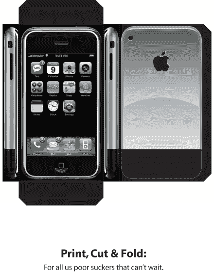

# 制作你自己的 iPhone(实际上没有功能)

> 原文：<https://web.archive.org/web/http://www.techcrunch.com:80/2007/01/27/make-your-own-iphone-does-not-actually-function/>

# 制作自己的 iPhone(实际上不起作用)

一位读者发来了下面的图片来“制作你自己的 [iPhone](https://web.archive.org/web/20220818080918/http://www.beta.techcrunch.com/2007/01/09/apple-announces-iphone-stock-soars/) ”刚打印，剪&折。但是请注意:这实际上不起作用(呵)。

如果任何人有这个归因，请让我知道，因为我不知道是谁创造了它。类似的产品是[这里的](https://web.archive.org/web/20220818080918/http://www.sneakmove.com/2007/01/diy-cut-and-fold-paper-iphone.html)。

