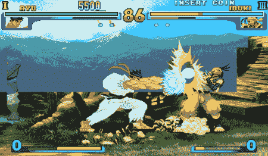

# MAME 开发者解密 CPS III，街头霸王 III 即将上线

> 原文：<https://web.archive.org/web/http://techcrunch.com/2007/06/20/mame-devs-decrypt-cps-iii-street-fighter-iii-playable-soon/>

大约一周前，MAME 的家伙们破解了 Capcom 的 CPS III 加密，从那以后取得了惊人的进展。(事实上，我刚刚从新闻组拿了一堆 CPS III 转储，为 Mac OS X 端口发布的那一刻做准备。CPS III 是所有 600 个版本的《街头霸王 III》都可以运行的硬件，但直到上周才与 MAME 模拟器兼容。你在这里找不到 ROM 链接，但当兼容 CPS III 的 MAME 上市时，你可以打赌我会请一天病假。抱歉，约翰。

谁知道呢，也许现在有人会复活 Xbox 1 的 MAME 端口。

[眼睛看这里](https://web.archive.org/web/20160221191946/http://www.speksnk.org/foro/viewtopic.php?t=66324&postdays=0&postorder=asc&start=0)【Speksnk.org via[Xbox-Scene](https://web.archive.org/web/20160221191946/http://www.xbox-scene.com/xbox1data/sep/EElkFEplZkaDEdEhOB.php)