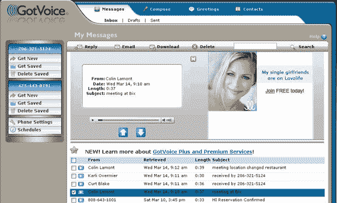

# 使用 GotVoice | TechCrunch 管理语音邮件

> 原文：<https://web.archive.org/web/http://www.techcrunch.com:80/2007/03/18/managing-voicemail-with-gotvoice/>

  当我[在 2005 年 6 月第一次评论 GotVoice](https://web.archive.org/web/20160420222955/http://www.techcrunch.com/2006/06/03/get-voicemail-in-your-email-inbox-gotvoice/) 的时候，我觉得这是一个很棒的应用程序，虽然有些粗糙。Gotvoice 的目标是给你的语音信箱带来理智，它做得很好。今晚，他们将重新推出一个更酷的界面和一大堆新功能。

以前的 GotVoice 是一项简单的服务，它使用你的语音邮件凭证，并将每个语音邮件转换成 MP3 文件。然后，Got Voice 会发送一封电子邮件，其中包含一个到 GotVoice 收件箱的链接。它基本上允许用户将语音邮件管理从手机转移到电脑上。

新功能将基本服务向前推进了几个步骤。首先，现在一个账户可以关联两部手机。此外，你现在可以通过服务中的录音机(或通过你的手机)编写语音邮件，并将其发送到联系人列表中的人的语音邮件中。这对于回复信息或者向一个或多个人广播新信息非常有用。

Gotvoice 的另一个有用的功能——因为它可以通过你的凭证访问你的电话管理员，你也可以用它来改变你的语音邮件问候语。他们发明了一个工具，可以把你的声音和你想上传的任何 MP3 混合在一起。一旦您创建了问候语，GotVoice 会将其转换为您的语音邮件问候语。

最后，最酷的新功能。GotVoice 将推出语音邮件收件箱页面的简化 WAP 版本，以便通过手机浏览器访问。其结果是，一旦 iPhone 推出自己的可视语音邮件，可视语音邮件产品肯定会风靡一时。这个页面可以通过浏览器访问，GotVoice 正在与美国的运营商合作，直接提供这种服务。

GotVoice 还没有做的是将语音邮件转换成文本，他们说他们正在通过合作进行这项工作。 [Jott](https://web.archive.org/web/20160420222955/http://www.techcrunch.com/tag/jott) 和 [Spinvox](https://web.archive.org/web/20160420222955/http://www.techcrunch.com/2007/01/17/spinvox-launching-in-us-we-have-100-accounts-to-give-away-now/) 现在这样做，有点钻 GotVoice 的空子。我期待着该功能很快被添加。

GotVoice 有免费版和高级版(每月 9.95 美元)。2005 年 10 月，该公司从 Ignition Partners、Second Avenue Partners 和 Cedar Grove Investments 筹集了 300 万美元。

