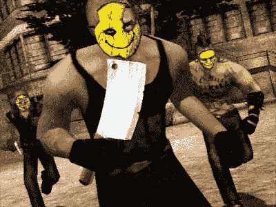

# 《追捕 2》在英国被禁:终于摆脱了

> 原文：<https://web.archive.org/web/http://techcrunch.com/2007/06/19/manhunt-2-banned-in-the-uk-good-riddance/>

英国电影分级委员会已经禁止销售《追捕 2》( T3 ),该片原定于下个月与《T5》Wii、《T7》PS2 和《T9》PSP 上映。正如你所料，分级委员会引用了这款游戏对“极度缺乏缓和或距离感的本能杀戮”的鼓励。在游戏中，这些杀戮的实施和鼓励方式是持续的、累积的、随意的虐待狂。”所以因为这个游戏“鼓励”肆意的暴力，它被禁止，被审查，永远不要踏上英国的土地。

很好。

是时候让人们站出来反对这些色情小贩，要求他们承担一些责任了。我们真的想让我们的孩子接触这些肮脏的东西吗？一个正派的人怎么能为一个以寻找其他人并消灭他们为主要目标的游戏辩护呢？拿我来说，我想生活在一个赞美生命的社会，而不是一个赞美死亡的社会。虽然我肯定会有人说，“你不能禁止 X 而不禁止 Y，因为这会造成滑坡。”废话。“滑坡”的论点可能是最理智破产的论点。

我为 BBFC 禁止这款游戏在英国销售的决定喝彩。也许如果我们在美国的领导人有任何道德勇气，他们会在这个重要问题上跟随英国的领导。

[英国禁售《追捕 2》](https://web.archive.org/web/20160414022024/http://www.gamesindustry.biz/content_page.php?aid=25909)[games industry . biz]