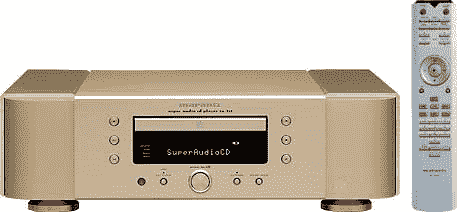

# 马兰茨 SA-7S1 SACD 播放器| TechCrunch

> 原文：<https://web.archive.org/web/http://techcrunch.com/2006/08/25/marantz-sa-7s1-sacd-player/>

制造许多昂贵产品的马兰士公司已经发布了 SA-7S1，一款超级音乐 CD 播放器。它拥有内置的防振技术，可以让你的 SACDs 和 CD 无抖动播放。这是一个非常有用的功能，因为我相信你们都很清楚 CD 播放器振动的程度。

它将于今年十月在日本上市。价格标签定为 6200 美元，因为正如你所见，它是由纯金制成的——好吧，真的只是彩色的黄金，但就这个价格而言，它*应该*是由黄金制成的。

[马兰士 SA-7S1 SACD 玩家:人家用囊袋？](https://web.archive.org/web/20140121145256/http://gizmodo.com/gadgets/home-entertainment/marantz-sa7s1-sacd-player-people-use-sacds-196688.php)【小发明】