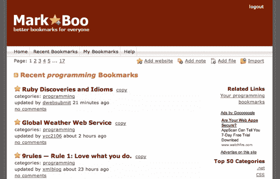

# Markaboo 是非常棒的开源社会化书签

> 原文：<https://web.archive.org/web/http://www.techcrunch.com:80/2006/06/18/markaboo-is-awesome-%20open-source-social-bookmarking/>

 
[Markaboo](https://web.archive.org/web/20070910203346/http://markaboo.com/) 是由克里斯蒂安·罗姆尼和吉恩·托马斯从一家名为 [tglo](https://web.archive.org/web/20070910203346/http://www.onclickdialto.com/) 的公司开发的一款奇妙的新社交书签工具。它是开源的，有很棒的特性集。

我使用 del.icio.us 作为我的社交书签已经有一段时间了，主要是出于习惯。其他社交书签工具的功能对我来说非常有吸引力，但没有一个足够吸引人和有用，让我认真考虑离开 del . icio . us——直到现在。

要保存到 Markaboo 的 bookmarklet 包括 URL、标题、标签和描述的所有基本字段。有一个很好的选项可以查看你所有的标签，并点击你想要应用的标签。

用户还可以进入 notes 页面并将文件作为单独的项目上传到他们的档案中；Markaboo 不仅仅是用来保存网址的。最好的一个功能是，照片和笔记可以通过手机和电子邮件保存、命名和标记。

书签和收藏夹可以以多种不同的格式导入。商品页面上有简单、不显眼的谷歌广告。Markaboo 用户社区目前由程序员组成，但该系统非常容易使用，共享书签可能会迅速多样化。

虽然书签可以被指定为私有，但默认情况下，您可以查看或订阅任何人的书签。到目前为止，该网站还不支持按标签显示“流行”项目，但随着使用的扩大，我可以想象它会被包括在内。

这只是一个坚实的，有吸引力的，易于使用的社会书签服务。爱很容易。当前版本于上周三发布，开发人员表示，社区将为 1.0 版本塑造特性集。如果现在有出口选择，我看不到。我认为开发者社区会让这一切发生。

如果 Markaboo 工作得不好或者选择有限，我仍然会对它感兴趣，因为代码是通过一个归属、非商业性、类似共享的知识共享许可与感兴趣的开发者共享的。好在系统本身就很牛逼。

几个注意事项:该网站的 Safari 帐户创建有问题，尽管 Firefox 运行良好，我还没有在 IE 上测试过。参见下面的评论，讨论为什么非商业条款是一个糟糕的举动，以及该公司如何处理它。【更新:非商业条款在讨论后不到 24 小时就被删除。]如果你喜欢 Ruby on Rails 这样的应用，可以看看本周末的 2006 年 Rails 日。服务最初是通过 [eHub](https://web.archive.org/web/20070910203346/http://emilychang.com/go/ehub) 发现的，感谢艾米莉。

这篇文章发表于 2006 年 6 月 18 日周日 9:58，归档在[公司&产品简介](https://web.archive.org/web/20070910203346/http://www.techcrunch.com/category/company-product-profiles/ "View all posts in Company & Product Profiles")下。您可以通过 [RSS 2.0](https://web.archive.org/web/20070910203346/http://www.techcrunch.com/2006/06/18/markaboo-is-awesome-open-source-social-bookmarking/feed/) feed 关注该条目的任何回复。评论和 pings 目前都已关闭。