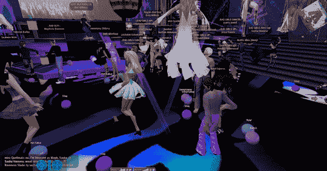

# 营销人员意识到第二人生不值得麻烦

> 原文：<https://web.archive.org/web/http://techcrunch.com/2007/07/16/marketers-realizing-that-second-life-aint-worth-the-trouble/>

 
耶……不完全是高端购物者

第二人生可能会走向虚拟市场崩溃。营销人员和雅乐轩连锁酒店等传统零售商发现，SL 用户不一定会转化为现实世界的顾客。([告诉我们](https://web.archive.org/web/20160307175126/http://crunchgear.com/2007/07/13/james-wagner-au-to-second-life-marketers-dont-be-stupid/)一些我们不知道的事情。)他们还发现，当 SL 用户购买用于网络世界的物品时，他们主要购买非正统的物品，如“婚姻助手”和毛茸茸的另类生活配件。你知道，那些真正的企业不喜欢的东西。

据说 SL 的用户对他们的整个幻想世界被“那个人”入侵感到不安我去年对这个游戏做了一个小调查，注意到了同样的心态。因此，如果广告商想从这款游戏的受欢迎程度上赚点快钱(或林登币)——活跃用户的数量也存在争议，这进一步吓跑了广告商和公司——他们可能需要重新考虑。

我建议我们让这些古怪的人独自存在，并坚持在黄金时段做广告。

虚拟营销人员对第二人生有了新的想法