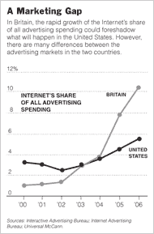

# Mashup*:了解为什么“网络广告的未来在英国！

> 原文：<https://web.archive.org/web/http://techcrunch.com/2006/12/05/mashup-learn-why-the-future-of-web-ads-is-britain/>

据《纽约时报》和雅虎报道，网络广告的未来在英国！

> “在线广告在英国遥遥领先，年增长率约为**40%**，根据媒体购买机构的数据，预计今年将占整体广告支出的 14%。这是世界上最高的水平，是美国的两倍多。”

> “美国远远落在后面，”雅虎首席执行官特里·S·塞梅尔最近在伦敦的一次演讲中说。“它肯定比英国落后至少一两年。”

因此，下一次 [mashup](https://web.archive.org/web/20160127071104/http://www.etribes.com/mashup) *活动的主题将是广告 2.0，这是非常及时的——听听在线广告是如何发展的，变得个性化、有针对性和相关。了解这对在线服务、媒体业务、营销部门意味着什么，以及个人出版、社交网络和数字生活方式聚合器如何发展以提供高效的营销平台。

该活动将于 12 月 13 日星期三下午 6 点在伦敦莱姆街 1 号劳埃德的船长室举行，[EC3M 7HA](https://web.archive.org/web/20160127071104/http://local.google.co.uk/maps?f=q&hl=en&q=EC3M+7HA&ie=UTF8&z=17&om=1&iwloc=addr)–详情[此处](https://web.archive.org/web/20160127071104/http://www.etribes.com/mashup/venue)。

发言人、小组成员和贡献者现已敲定。这个小组包括版权营销公司的联合创始人兼创意总监迈克尔·贝勒。雅虎广告技术主管大卫·布罗斯欧洲和**埃丝特·戴森，**“自由编辑”CNET——发言人和小组成员的完整名单可在[此处](https://web.archive.org/web/20160127071104/http://www.etribes.com/node/49355)获得。