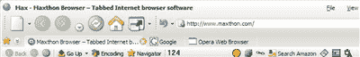
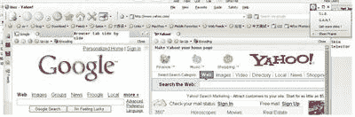

# 傲游:震撼 TechCrunch 的浏览器

> 原文：<https://web.archive.org/web/http://www.techcrunch.com/2006/02/28/maxthon-the-browser-that-rocks/>

# 傲游:震撼的浏览器

在我看来，傲游是互联网浏览器的最佳替代品。Firefox 和 Opera 都做得很好(无论是产品还是 buzz ),但它们就是赶不上傲游。

由年轻有为的陈明杰于 2003 年在中国(以 MyIE 的名字)创立，傲游在亚洲(去年在[红鲱鱼亚洲](https://web.archive.org/web/20221002010337/http://www.redherring.com/rhasia100/Nomination.html)获奖)和全世界迅速走红。与其他浏览器的最大区别是，傲游是基于 IE 代码的，这使得该软件从一开始就非常熟悉，但有一些变化。不像 IE，它非常快，安全，非常稳定，带来了独特的浏览体验，因为它可以让你定制软件的几乎任何部分。像 Firefox 一样，Maxthon 带来了标签浏览、嵌入式 RSS 和播客阅读器(一款[非常酷的](https://web.archive.org/web/20221002010337/http://net.typepad.com/maxthon_blog/2006/02/i_love_the_podc.html))、搜索栏……但没有必要添加任何扩展。

傲游的主要优势在于它能让你以极其简单的方式完全定制你的浏览体验。几个例子:URL 快捷方式。你可以设置一个 URL 别名(例如“2”)，然后直接在地址栏中输入你选择的 URL(例如:你的 flickr 页面)，而不是输入一个 URL 或者点击一个书签。你可以很容易地改变皮肤，提供了广泛的选择。鼠标手势也很棒，就像超级拖放功能一样，可以保存图像或在网页中搜索给定的单词。

这里有太多的功能来涵盖它们。我认为你应该首先使用它(提示:几乎在任何地方都可以使用右键)。我认识的所有尝试过的人都喜欢它。这听起来可能在某些方面太像火狐了，但又不是。为了更好地理解傲游的优点，请阅读互联网周的这篇文章。

## 傲游 2.0 独家截图

我们可以得到独家的初始截图和即将到来的下一个 2.0 版本的新闻。相信傲游会变得更好。他们现在正在建立一个更好的界面，具有更大的定制化、数据共享、多窗口浏览、酷酷的博客功能和许多其他暂时保密的功能。

高质量带来高人气，傲游刚刚超过**5000 万次下载**(在[他们的博客](https://web.archive.org/web/20221002010337/http://net.typepad.com/maxthon_blog/2006/02/maxthon_passes_.html)和[每日 OM](https://web.archive.org/web/20221002010337/http://daily.gigaom.com/2006/02/27/maxthon-browser-passed-50-million-downloads/) 上公布)

除了好的产品和关键的规模，傲游还拥有巨大的成功资产:首先是一个伟大的团队，包括 SVP 巴士的 Netanel Jacobsson。开发(前 AOL/ICQ guy)。第二，强大的股东包括[Morten Lund](https://web.archive.org/web/20221002010337/http://mortenlund.blogspot.com/)(Skype 早期投资者)和 [WI Harper](https://web.archive.org/web/20221002010337/http://www.wiharper.com/) 。

傲游在美国还不是很受欢迎，但我打赌它很快就会改变。

现在让我们看看这篇文章是否会像法国 TechCrunch 上的[原文](https://web.archive.org/web/20221002010337/http://fr.beta.techcrunch.com/2006/02/27/maxthon-le-must-des-navigateurs/)一样引发激烈的争论:)