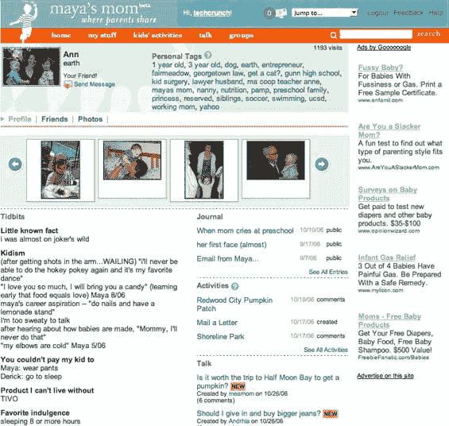

# 玛雅的妈妈募集天使轮，推出| TechCrunch

> 原文：<https://web.archive.org/web/http://www.techcrunch.com:80/2006/10/27/mayas-mom-raises-angel-round-launches/>

# 玛雅的妈妈举起天使轮，发射

  帕洛阿尔托[玛雅的妈妈](https://web.archive.org/web/20230222044552/http://www.crunchbase.com/company/mayasmom)是一种雅虎问答加脸书，对于父母来说，我们之前在四月[宣布](https://web.archive.org/web/20230222044552/https://techcrunch.com/2006/04/12/mayas-mom-for-parents/)。该网站昨天上线，已经有了相当深入的内容。

其他公司也在寻找育儿/家庭社交网络的机会(我们已经介绍了 [Minti](https://web.archive.org/web/20230222044552/https://techcrunch.com/2006/03/09/minti-niche-web-20-stuff-is-coming/) 、 [Famster](https://web.archive.org/web/20230222044552/https://techcrunch.com/2006/08/19/famsters-hamster-wants-to-network-with-your-mom/) 和 [FriendsForFamilies](https://web.archive.org/web/20230222044552/https://techcrunch.com/2006/09/16/matchcom-for-families/) )。但 Maya 的妈妈专注于允许用户首先向他人请求和提供建议，然后是更传统的社交网络功能。

玛雅妈妈的心脏是他们的“谈话”部分。与 Minti 的文章格式不同，Maya's Mom 允许你公开、匿名或向特定的朋友发布任何问题。用户可以通过 RSS 订阅最新的问题。问题按标签分组，并在提交时进行重复分析。您可以通过关键字或标签来搜索答案。如果有人已经提出了类似你的问题，玛雅的妈妈会指引你找到他们的答案。像活动一样，您也可以创建列表，并在问题有新答案时得到提醒。

该公司拥有一批来自最近一轮“约 100 万美元”天使轮的强大初始投资者——True Ventures、杰夫·克拉维尔、詹姆斯·库里耶、卡特琳娜·法克、杰夫·罗尔斯顿、雷蒙德·斯特恩和迈克尔·坦纳。玛雅妈妈的博客[在这里](https://web.archive.org/web/20230222044552/http://www.mayasmom.com/blog)。如果你想知道公司的名字，玛雅是创始人安·克拉迪的女儿。我想知道安的儿子吴镇男是否有一天会因为网站不是以他的名字命名而感到不那么受欢迎。

