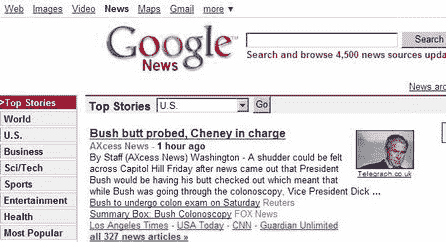

# 也许谷歌新闻需要一点调整——TechCrunch

> 原文：<https://web.archive.org/web/http://www.techcrunch.com:80/2007/07/21/maybe-google-news-needs-a-little-tweaking/>

# 也许谷歌新闻需要一点调整

一个有趣的故事今天出现在我的办公桌上——一个名为 Axcess News 的“新闻”网站报道说，老布什总统正在接受结肠镜检查，在检查过程中，副总统切尼负责管理美国。

[文章](https://web.archive.org/web/20220807133832/http://www.axcessnews.com/index.php/articles/show/id/11684)是昨天谷歌新闻的头条新闻，标题很不幸*“布什屁股被调查，切尼掌权”*并以*开头:“周五，在布什总统将被检查屁股的消息传出后，整个国会山都能感觉到颤抖……”*

谷歌新闻的快速搜索显示这个故事仍然被编入索引。或许谷歌现在会重新考虑 Axcess 新闻是否应该保留在谷歌新闻索引中？

顺便说一下，Axcess News 是受人尊敬的[在线新闻协会](https://web.archive.org/web/20220807133832/http://www.journalists.org/)的[成员，该协会自称是一个严肃的在线新闻网站团体。USAToday.com 的执行编辑金赛·威尔森是 ONA 的主席。](https://web.archive.org/web/20220807133832/http://www.axcessnews.com/index.php/pages/show/id/1)