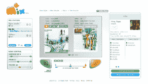

# MeeMix:一种新的音乐个性化诞生了 TechCrunch

> 原文：<https://web.archive.org/web/http://www.techcrunch.com:80/2007/08/01/meemix-a-new-breed-of-music-personalization-is-born>

# MeeMix:一种新的个性化音乐诞生了

 总部位于特拉维夫的 [MeeMix](https://web.archive.org/web/20221130201609/http://meemix.com/) 今天发布了它的测试程序。像 Pandora 一样，MeeMix 是一个面向 15-35 岁人群的社区音乐/网络电台服务。这个想法是，任何用户都可以创建一个高度个性化、基于品味的音乐频道，而不需要太多的麻烦。MeeMix 和 [Pandora](https://web.archive.org/web/20221130201609/http://www.crunchbase.com/company/pandora) 或 [Last.fm](https://web.archive.org/web/20221130201609/http://www.crunchbase.com/company/last.fm) 的主要区别在于它预测个人品味的方式。

通常，有两种方法来执行这种预测:

1.  “自然”([Pandora](https://web.archive.org/web/20221130201609/http://www.crunchbase.com/company/pandora))——决策是基于一首歌和另一首歌的兼容性——个人品味不是这个等式的一部分。
2.  “养育”([last . FM](https://web.archive.org/web/20221130201609/http://www.crunchbase.com/company/last.fm))——决策是基于环境因素——歌曲的兼容性不是等式的一部分

史蒂夫·克劳斯写了一篇关于音乐领域先天与后天的伟大文章。

像 Pandora 一样，MeeMix 将每首歌、艺术家和用户分解到元素级别。然后，它的推荐引擎分析用户的个人资料、音乐选择和行为的组合，以创建定制的电台。在我的个人测试中，MeeMix 的音乐选择近乎完美。

 MeeMix 拥有丰富的社交网络功能集，包括评论、想法(公共用户发帖)、秘密(私人用户发帖)等。在我看来，这些功能中最重要的是能够与其他频道用户实时收听同一首歌曲。对于我们观众中的自大狂，你甚至可以打印出一件印有你的频道名称和订户数量的 t 恤(由 Zazzle API 提供)。

MeeMix 于 2006 年年中由首席执行官 Gilad Shlang 和 Ricardo Tarrasch 博士(首席科学家)创建，前者是 888.com 公司的用户体验经理，后者也是 888.com 大学的生物心理学博士。这两位在基于算法预测创建和利用用户体验和社区方面拥有丰富的经验。该公司由天使投资，目前雇佣了一个 9 人团队，包括 ICQ 的前首席开发人员、音乐学家和一名社区/搜索引擎优化专家。

商业模式目前基于专辑销售，并将扩展到歌曲、铃声和广告。鉴于引擎罩下有如此多的算法魔法，如果在一两年内授权其引擎将成为 MeeMix 的核心业务，我不会感到惊讶。

与此同时，该团队正专注于了解其社区，并扩大其服务的规模和应用范围(嵌入式 web widgets 和脸书应用程序)。

**试试 MeeMix**

我们有 1000 份邀请可以参加 MeeMix 私人测试版[这里](https://web.archive.org/web/20221130201609/http://www.meemix.com/preview/techcrunch)。

*这篇客座博文是由以色列创业顾问 [Roi Carthy](https://web.archive.org/web/20221130201609/http://www.roicarthy.com/) 撰写的。投资回报率将涵盖 TechCrunch 的以色列创业场景。*