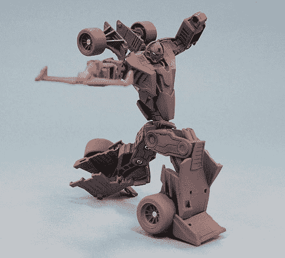

# 见见毁了变形金刚的家伙

> 原文：<https://web.archive.org/web/http://techcrunch.com/2007/07/03/meet-the-guy-who-ruined-transformers/>

# 见见毁了变形金刚的家伙

汽车人幻影

我说的不是迈克尔·贝。亚历克斯·库巴尔斯基是一名澳大利亚玩具设计师，他为日本玩具公司 Takarotomy 工作，该公司与孩之宝合作重新设计了你将在新电影中看到的变形金刚。或者，如果你是一个铁杆粉丝，原版的毁灭。

我实际上对亚历克斯有点苛刻，因为他与汽车人和霸天虎的实际重新设计毫无关系，但他负责大黄蜂的变形场景。让我告诉你那些有多热…呃，至少那是[告诉我的。☺](https://web.archive.org/web/20130628204712/http://crunchgear.com/2007/06/30/exclusive-transformers-footage-from-last-nights-screening/)

采访的其余部分非常有趣，是关于他是如何开始的，以及“改造”汽车人和霸天虎的整个设计过程，但我不能再往下读了，否则会让我更加难过。在这部新电影的众多悲剧中，擎天柱是一辆平头半挂卡车，大黄蜂不是一辆卡玛洛，爵士也不是一辆城市庞蒂亚克夏至。但你还是应该去看。对我来说，这是梦想成真。

[变形金刚的玩具设计](https://web.archive.org/web/20130628204712/http://pingmag.jp/2007/06/29/transformers/)【via[东京芒果](https://web.archive.org/web/20130628204712/http://www.tokyomango.com/tokyo_mango/2007/07/transformers-pr.html)