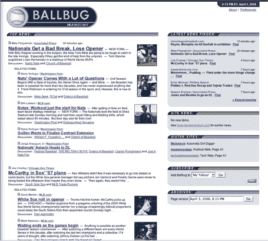

# Memeorandum 做棒球——TechCrunch

> 原文：<https://web.archive.org/web/http://www.techcrunch.com:80/2006/04/03/memeorandum-does-baseball>

# Memeorandum 做棒球

  今年追踪美国职业棒球大联盟的报道会比以前容易一点——Gabe Rivera 今天推出了一个名为 [BallBug](https://web.archive.org/web/20220112001231/http://www.ballbug.com/) 的 Memeorandum 网站。BallBug 提供了一个新闻摘要，每五分钟更新一次，重点关注网络上最热门的棒球报道和博客帖子。这就像是 [tech.memeorandum](https://web.archive.org/web/20220112001231/http://tech.memeorandum.com/) ，但是对于棒球来说。

这是好消息。由于 Gabe 的其他网站，我对[政治新闻](https://web.archive.org/web/20220112001231/http://www.memeorandum.com/)和[名人八卦新闻](https://web.archive.org/web/20220112001231/http://www.wesmirch.com/)略知一二。现在我想我也能跟上棒球世界了。

Memeorandum 的下一个垂直网站是什么？加布不会说得太具体，但据我所知，他是一个讨论追随者。如果博客在谈论一些事情，并且有很多来回的链接，那就期待 Memeorandum 最终会出现。

更多关于 [Memeorandum 博客](https://web.archive.org/web/20220112001231/http://blog.memeorandum.com/060403/ballbug)。

