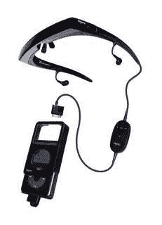

# MicroOptical myvu 专为 iPod edition 打造| TechCrunch

> 原文：<https://web.archive.org/web/http://techcrunch.com:80/2006/09/18/microoptical-myvu-made-for-ipod-edition/>

MicroOptical 今天宣布了一款为 iPod 视频开发的个人媒体浏览器(又名视频眼镜)。这款眼镜模拟了一个 27 英寸的屏幕，可以从 6 英尺外观看。与类似的设备不同，用户可以看到屏幕的上方和下方，这样他们就可以对周围的环境有所了解。它使用超薄的可充电锂电池，可以提供六个小时的播放时间，包括降噪耳塞，有电线控制，并配有一个可以容纳 iPod 的旅行箱。myvu 系统将于今年秋天上市，售价 399 美元。

有人试过这样的吗？在我看来它会把你的眼球从脑袋里烤焦。我记得以前使用虚拟男孩的时候，它会让我头痛欲裂。我认为这将有大致相同的效果。

[MicroOptical 宣布专为 iPod 眼镜制造。](https://web.archive.org/web/20150923154907/http://mobilitytoday.com/news/006934/micro_glass_ipod)【今日移动】